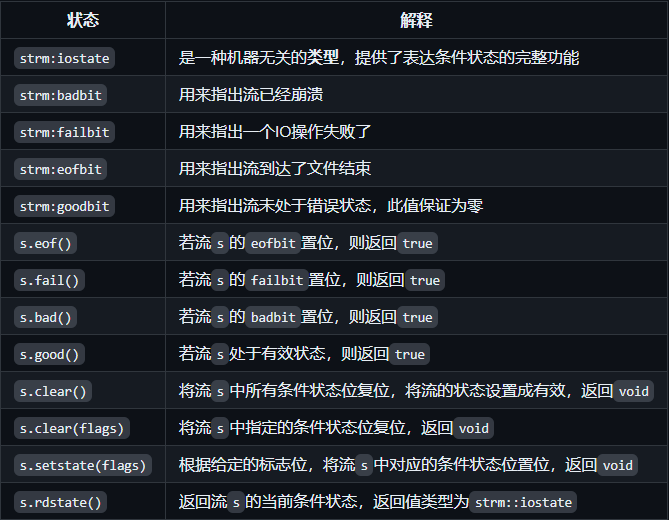
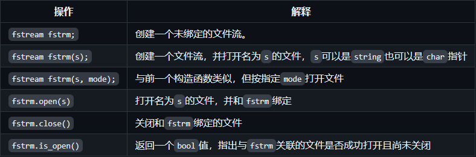

## I/O library

- `istream`: Input stream type that provides input operations.

- `ostream`: Ouput stream type that provides input operations.

- `cin`: An `istream` object that reads data from standard inputs

- `cout`: An `ostream` object that writes data to the standard output.

- `>>`: Used to read input data from an `istream` object.

- `<<`: Used to write output data to an `ostream` object.

- `getline`函数： Reads a line of data from a given `istream` object into a given string object.

  ```c++
  std::istream& getline(std::istream& input, std::string& str);
  // case
  std::getline(std::cin, line);
  ```

### I/O type in STL

`iostream`: reading or writing data from standard stream, such as `istream`, `ostream`

`fstream`: reading data from files, `ifstream`, `ofstream`

`sstream`: reading data from string, `istringsatream`, `ostringstream`

### I/O objects cannot be copied or assigned

1. **I/O object can't exist in container**
   IO objects like (`std:cin`, `std:cout`) are irreproducible, so they can't exists in containers like `std:vector` , `std:list`
2. **Formal parameters and return types also cannot be stream types**
   Because I/O **objects** cannot be copied, they cannot be used as arguments or return values for functions. This means that you can't define a function that accepts or returns an I/O **object** because that would attempt to copy the I/O object.
3. **Formal parameters and return types are generally references to streams**
   Since I/O objects cannot be copied, functions usually pass I/O objects by **reference**. This avoids the copying problem while allowing the function to manipulate the passed I/O object directly.
4. **Reading and writing an I/O object changes its state, so the reference passed and returned cannot be const**
   Reading and writing I/O objects changes their internal state, such as file pointer locations, error flags, and so on. Therefore, you cannot use the `const` modifier when you pass or return a reference to an I/O object. Using `const` restricts modifications to the state of the object, which is inappropriate when dealing with I/O operations.

```c++
#include <iostream>
#include <fstream>

// function accepts a non-const I/O stream reference as a parameter
void readLine(std::istream& input) {
    std::string line;
    std::getline(input, line);
    std::cout << "You entered: " << line << std::endl;
}

int main() {
    // Read a line from standard input
    std::cout << "Enter a line of text: ";
    readLine(std::cin);

    // Read a line from a file
    std::ifstream file("example.txt");
    if (file.is_open()) {
        readLine(file);
        file.close();
    } else {
        std::cerr << "Unable to open file";
    }

    return 0;
}
```

In this case:

1. The `readLine` function accepts an `std::istream&` (**a reference to the input stream**) as an argument. This avoids copying I/O objects.
2. Reading and writing `input` changes its state, e.g. reading the position, so `input` cannot be a `const` reference.
3. In the `main` function, we read a line of data from standard input and a file, respectively, and pass it by reference to the `readLine` function.

### condition state



In the table above, `strm` is an IO type, (like `istream`) and `s` is a stream object.

### File I/O

The header file `fstream` defines three types to support file IO:

- `ifstream` reads data from a given file.
- `ofstream` writes data to a given file.
- `fstream` can read and write the given file.

```c++
#include <iostream>
#include <fstream>
#include <string>

int main() {
    // Write data to a file using ofstream
    std::ofstream outFile("example.txt");
    if (outFile.is_open()) {
        outFile << "This is a line of text.\n";
        outFile << "This is another line of text.\n";
        outFile.close();
    } else {
        std::cerr << "Unable to open file for writing";
    }

    // Reading data from a file using ifstream
    std::ifstream inFile("example.txt");
    if (inFile.is_open()) {
        std::string line;
        while (std::getline(inFile, line)) {
            std::cout << line << std::endl;
        }
        inFile.close();
    } else {
        std::cerr << "Unable to open file for reading";
    }

    // Reading and writing files with fstream
    std::fstream file("example.txt", std::ios::in | std::ios::out | std::ios::app);
    if (file.is_open()) {
        // Additional line of text
        file << "Appending a new line of text.\n";

        // Move the file pointer to the beginning of the file
        file.seekg(0);

        // Read the contents of the file
        std::string line;
        while (std::getline(file, line)) {
            std::cout << line << std::endl;
        }
        file.close();
    } else {
        std::cerr << "Unable to open file for reading and writing";
    }

    return 0;
}
```

### fstream-specific operation



### file mode


### String stream

The header file `sstream` defines three types to support memory IO:

- `istringstream` reads data from `string`.
- `ostringstream` writes data to `string`.
- `stringstream` can read and write the given `string`.

```c++
#include <iostream>
#include <sstream>
#include <string>

int main() {
    // Writing to a String with ostringstream
    std::ostringstream oss;
    oss << "This is a line of text.\n";
    oss << "This is another line of text.\n";
    std::string outStr = oss.str(); // 获取写入的字符串
    std::cout << "Output string:\n" << outStr << std::endl;

    // Reading data from a string using istringstream
    std::istringstream iss(outStr);
    std::string line;
    std::cout << "Reading from string:" << std::endl;
    while (std::getline(iss, line)) {
        std::cout << line << std::endl;
    }

    // Reading and writing strings with stringstream
    std::stringstream ss;
    ss << "Initial text.\n";
    ss << "More text.\n";
    std::string readStr;
    std::cout << "Reading and writing with stringstream:" << std::endl;
    while (std::getline(ss, readStr)) {
        std::cout << readStr << std::endl;
    }
    ss.clear(); // Clear the error flag
    ss << "Appending new text.\n";
    ss.seekg(0); // Go back to the beginning of the string
    while (std::getline(ss, readStr)) {
        std::cout << readStr << std::endl;
    }

    return 0;
}
```

## Sequential container

| container type | describe                                                                                                                                    |
| -------------- | ------------------------------------------------------------------------------------------------------------------------------------------- |
| vector         | Variable size arrays. Supports fast random access. Inserting or deleting elements at **positions other than the tail** may be **slow**.     |
| deque          | Double-ended queues. Supports fast random access. Insertion/deletion in **header** and **tail** positions is **fast**                       |
| list           | Bidirectional chained tables. Insert/delete operations **anywhere** in the **list** are **fast**.                                           |
| forward list   | Unidirectional chained tables. Insert/delete operations at **any position** in the **chain table** are **fast**.                            |
| array          | Fixed size arrays. Supports fast random access. **Cannot add or remove elements.**                                                          |
| string         | Containers similar to vectors, but specialised for holding characters. Random access to blocks. **Fast** insertion/deletion at the **end**. |
==**Usually using a vector is the best choice, unless you have a good reason to choose another container.**==

### Constructor

| Operation               | Comment                                                                                                                 |
| ----------------------- | ----------------------------------------------------------------------------------------------------------------------- |
| `C c`                   | default constructor                                                                                                     |
| `C c1(c2)` or `C c1=c2` | copy constructor                                                                                                        |
| `C c(b,e)`              | construct `c`, copy all elements from interator `b` and `e` to `c`                                                      |
| `C c(a,b,c...)`         | list initialize `c`                                                                                                     |
| `C c(n)`                | Only sequential containers are supported and do not include arrays, containing `n` elements which are value initialised |
| `C c(n, t)`             | contains `n` elements with initial value `t`                                                                            |
- Unlike other containers, the default constructed `array` is non-empty.
- Only the constructor for sequential containers accepts the size parameter; associative containers are not supported.
- Copying with an iterator: the container types are not required to be the same, and the element types within the containers can be different.
### Assigning & Swap

| operation                     | description                                                              |
| ----------------------------- | ------------------------------------------------------------------------ |
| `c1.swap(c2)`                 | exchange `c1` and `c2`                                                   |
| `swap(c1,c2)`                 | same with above                                                          |
| `c.assign(l.begin(),l.end())` | Replace the elements in `c` with iterators `l` from its `begin` to `end` |
| `c.assign({1,2,3,...})`       | Replace the elements in `c` with the elements in the initialisation list |
| `c.assign(n, r)`              | Replace the elements in `c` with `n` elements whose values are `r`       |
==`c.size()` return the number of c, but it doen't appropiate to `forward_list`==
### insert element

| Operation                   | Description                                                 |
| --------------------------- | ----------------------------------------------------------- |
| `c.insert(p,t)`             | create a element `t` before `p`                             |
| `c.insert(p,n,t)`           | insert n `t` before `p`                                     |
| `c.insert(p,b,e)`           | insert the scope from `l.begin()` to `l.end()` front of `p` |
| `c.insert(p,{1,2,34,5...})` | insert `{}` front of `p`                                    |
- `forward_list` has its own proprietary version of `insert` and `replace`. 
- `forward_list` does not support `push_back` and `emplace_back`.
### Change Container Size

| Operation        | Description                                                                                                                                       |
| ---------------- | ------------------------------------------------------------------------------------------------------------------------------------------------- |
| `c.resize(n)`    | Resize c to n elements, if `n<c.size()`, the extra elements are discarded. If new elements must be added, initialise the new elements with values |
| `c.resize(n, t)` | Resize c to n elements and any newly added elements are **initialised to the value `t`**                                                          |
### Additional members of the reverse container

| Operation                  | Description                                                                                        |
| -------------------------- | -------------------------------------------------------------------------------------------------- |
| `reverse_iterator`         | Iterators addressing elements in reverse order                                                     |
| `const_reverse_iterator`   | Reverse-order iterators that cannot modify elements                                                |
| `c.rbegin()`, `c.rend()`   | Returns an iterator pointing to the position before the tail element and the first element of `c`. |
| `c.crbegin()`, `c.crend()` | Return`const_reverse_iterator`                                                                     |
### Iterator

- Iterator range: `begin` to `end`, i.e., the first element to one position after the last element.
- Left closed interval: `[begin, end)`
- Programming settings for left closure range implied:
  - If `begin` and `end` are equal, the range is empty.
  - If the two are not equal, the range contains at least one element and begin points to the first element in the range.
  - It is possible to increment `begin` a number of times such that `begin == end`.
### 容器操作可能使迭代器失效

- 在向容器添加元素后：
  - 如果容器是`vector`或`string`，且存储空间被重新分配，则指向容器的迭代器、指针、引用都会失效。
  - 对于`deque`，插入到除首尾位置之外的任何位置都会导致指向容器的迭代器、指针、引用失效。如果在首尾位置添加元素，迭代器会失效，但指向存在元素的引用和指针不会失效。
  - 对于`list`和`forward_list`，指向容器的迭代器、指针和引用依然有效。
- 在从一个容器中删除元素后：
  - 对于`list`和`forward_list`，指向容器其他位置的迭代器、引用和指针仍然有效。
  - 对于`deque`，如果在首尾之外的任何位置删除元素，那么指向被删除元素外其他元素的迭代器、指针、引用都会失效；如果是删除`deque`的尾元素，则尾后迭代器会失效，但其他不受影响；如果删除的是`deque`的头元素，这些也不会受影响。
  - 对于`vector`和`string`，指向被删元素之前的迭代器、引用、指针仍然有效。
  - 注意：当我们删除元素时，尾后迭代器总是会失效。
  - 注意：使用失效的迭代器、指针、引用是严重的运行时错误！
  - 建议：将要求迭代器必须保持有效的程序片段最小化。
  - 建议：不要保存`end`返回的迭代器。
### How vector objects grow

`vector` and `string` are stored continuously in memory, if the originally allocated memory location has been used up, **it is necessary to reallocate new space**, **move the existing elements from the location they were in**, **and then add new elements to the new space.**

### 构造string的其他方法

| 操作 | 解释 |
|-----|-----|
| `string s(cp, n)` | `s`是`cp`指向的数组中前`n`个字符的拷贝，此数组 |
| `string s(s2, pos2)` | `s`是`string s2`从下标`pos2`开始的字符的拷贝。若`pos2 > s2.size()`，则构造函数的行为未定义。 |
| `string s(s2, pos2, len2)` | `s`是`string s2`从下标`pos2`开始的`len2`个字符的拷贝。 |

- `n`,`len2`,`pos2`都是无符号值。

### substr操作

| 操作 | 解释 |
|-----|-----|
| `s.substr(pos, n)` | 返回一个`string`，包含`s`中从`pos`开始的`n`个字符的拷贝。`pos`的默认值是0，`n`的默认值是`s.size() - pos`，即拷贝从`pos`开始的所有字符。 |

### 改变string的其他方法

| 操作 | 解释 |
|-----|-----|
| `s.insert(pos, args)` | 在`pos`之前插入`args`指定的字符。`pos`可以使是下标或者迭代器。接受下标的版本返回指向`s`的引用；接受迭代器的版本返回指向第一个插入字符的迭代器。 |
| `s.erase(pos, len)` | 删除从`pos`开始的`len`个字符，如果`len`被省略，则删除后面所有字符，返回指向`s`的引用。 |
| `s.assign(args)` | 将`s`中的字符替换成`args`指定的字符。返回一个指向`s`的引用。 |
| `s.append(args)` | 将`args`指定的字符追加到`s`，返回一个指向`s`的引用。 |
| `s.replace(range, args)` | 删除`s`中范围`range`中的字符，替换成`args`指定的字符。返回一个指向`s`的引用。 |

### string搜索操作

- `string`类提供了6个不同的搜索函数，每个函数都有4个重载版本。
- 每个搜索操作都返回一个`string::size_type`值，表示匹配发生位置的下标。如果搜索失败则返回一个名为`string::npos`的`static`成员（类型是`string::size_type`，初始化值是-1，也就是`string`最大的可能大小）。

| 搜索操作 | 解释 |
|-----|-----|
| `s.find(args)` | 查找`s`中`args`第一次出现的位置 |
| `s.rfind(args)` | 查找`s`中`args`最后一次出现的位置 |
| `s.find_first_of(args)` | 在`s`中查找`args`中任何一个字符第一次出现的位置 |
| `s.find_last_of(args)` | 在`s`中查找`args`中任何一个字符最后一次出现的位置 |
| `s.find_first_not_of(args)` | 在`s`中查找第一个不在`args`中的字符 |
| `s.find_last_not_of(args)` | 在`s`中查找最后一个不在`args`中的字符 |

args必须是一下的形式之一：

| `args`形式 | 解释 |
|-----|-----|
| `c, pos` | 从`s`中位置`pos`开始查找字符`c`。`pos`默认是0 |
| `s2, pos` | 从`s`中位置`pos`开始查找字符串`s`。`pos`默认是0 |
| `cp, pos` | 从`s`中位置`pos`开始查找指针`cp`指向的以空字符结尾的C风格字符串。`pos`默认是0 |
| `cp, pos, n` | 从`s`中位置`pos`开始查找指针`cp`指向的前`n`个字符。`pos`和`n`无默认值。 |

### s.compare的几种参数形式

逻辑类似于C标准库的`strcmp`函数，根据`s`是等于、大于还是小于参数指定的字符串，`s.compare`返回0、正数或负数。

| 参数形式 | 解释 |
|-----|-----|
| `s2` | 比较`s`和`s2` |
| `pos1, n1, s2` | 比较`s`从`pos1`开始的`n1`个字符和`s2` |
| `pos1, n1, s2, pos2, n2` | 比较`s`从`pos1`开始的`n1`个字符和`s2` |
| `cp` | 比较`s`和`cp`指向的以空字符结尾的字符数组 |
| `pos1, n1, cp` | 比较`s`从`pos1`开始的`n1`个字符和`cp`指向的以空字符结尾的字符数组 |
| `pos1, n1, cp, n2` | 比较`s`从`pos1`开始的`n1`个字符和`cp`指向的地址开始`n2`个字符 |

### string和数值转换

| 转换 | 解释 |
|-----|-----|
| `to_string(val)` | 一组重载函数，返回数值`val`的`string`表示。`val`可以使任何算术类型。对每个浮点类型和`int`或更大的整型，都有相应版本的`to_string()`。和往常一样，小整型会被提升。 |
| `stoi(s, p, b)` | 返回`s`起始子串（表示整数内容）的数值，`p`是`s`中第一个非数值字符的下标，默认是0，`b`是转换所用的基数。返回`int` |
| `stol(s, p, b)` | 返回`long` |
| `stoul(s, p, b)` | 返回`unsigned long` |
| `stoll(s, p, b)` | 返回`long long` |
| `stoull(s, p, b)` | 返回`unsigned long long` |
| `stof(s, p)` | 返回`s`起始子串（表示浮点数内容）的数值，`p`是`s`中第一个非数值字符的下标，默认是0。返回`float` |
| `stod(s, p)` | 返回`double` |
| `stold(s, p)` | 返回`long double` |
## Some Generics Algorithm

### Readonly Algorithm
`find_first_of`: The `find_first_of` algorithm searches the first range for any elements that match any of the elements in the second range. It returns an iterator to the first occurrence of any of the elements from the second range in the first range.
```c++
#include <iostream>
#include <vector>
#include <algorithm>

int main() {
    std::vector<int> vec1 = {1, 2, 3, 4, 5};
    std::vector<int> vec2 = {3, 4, 6};

    auto it = std::find_first_of(vec1.cbegin(), vec1.cend(), vec2.cbegin(), vec2.cend());

    if (it != vec1.cend()) {
        std::cout << "First matching element: " << *it << std::endl;
    } else {
        std::cout << "No matching elements found" << std::endl;
    }

    return 0;
}

// output
// First matching element: 3
```
### Write to Container
`back_inserter`: It is used to insert elements at the end of a container. This is particularly useful when using algorithms that generate new elements and you want to append these elements to an existing container.
Let's say you want to copy elements from one vector to another using `std::copy`. Instead of ensuring the destination vector has enough space, you can use `back_inserter` to automatically expand the destination vector as needed.
```c++
#include <iostream>
#include <vector>
#include <algorithm>
#include <iterator>

int main() {
    std::vector<int> src = {1, 2, 3, 4, 5};
    std::vector<int> dest;

    // Using std::copy with back_inserter
    std::copy(src.cbegin(), src.cend(), std::back_inserter(dest));

    std::cout << "Destination vector: ";
    for (const auto &elem : dest) {
        std::cout << elem << " ";
    }
    std::cout << std::endl;

    return 0;
}

// output
// Destination vector: 1 2 3 4 5
```
### Reranging Algorithm
`unique`: To remove duplicates from a container, you typically follow these steps
1. `Sort()` the container to bring duplicates together.
2. Use the `std::unique` algorithm to rearrange the container such that each unique element appears only once, followed by duplicates. `std::unique` returns an iterator to the end of the unique range.
3. **Use a container operation like `erase` to actually remove the duplicates.**
```c++
#include <iostream>
#include <vector>
#include <algorithm>

int main() {
    std::vector<int> vec = {5, 3, 8, 3, 5, 9, 1, 5};

    // Step 1: Sort the vector
    std::sort(vec.begin(), vec.end());

    // Step 2: Use std::unique to move duplicates to the end
    auto unique_end = std::unique(vec.begin(), vec.end());

    // Step 3: Erase the non-unique elements from the vector
    vec.erase(unique_end, vec.end());

    // Output the result
    std::cout << "Vector after removing duplicates: ";
    for (const auto& elem : vec) {
        std::cout << elem << " ";
    }
    std::cout << std::endl;

    return 0;
}

// output
// Vector after removing duplicates: 1 3 5 8 9
```
### Lambda Expression
format: `[capture list](parameter list) -> return type {function body}`
example:
- `auto wc = find_if(words.begin(), words.end(), [sz](const string &a){return a.size() >= sz;});`
- `for_each(wc, words.end(), [](const string &s){cout << s << " ";})`

**Value capture**: provided the variable can be copied. `size_t v1 = 42; auto f = [v1] {return v1;};`
**Reference capture**: It must be ensured that the variable is present when the lambda is executed,
`auto f2 = [&v1] {return v1;};`
==Minimise the amount of data captured and avoid **capturing pointers or references** where possible.==
#### capture list
`[]`: empty list, `lambda` can't use variable in function
`[&]`: Implicit capture lists, using **Reference** captures
`[=]`: Implicit capture lists, using **Value** captures
`[&, identifier_list]`: elements in `identifier_list` are captured by value, others are captured by reference
```c++
// Using a lambda to transform the vector 
// Capture `multiplier` by value and all other variables by reference 
std::transform(vec.begin(), vec.end(), vec.begin(), [&, multiplier](int x) { return x * multiplier + offset; });
```
`[=, identifier_list]`: elements in `identifier_list` are captured by reference, others are captured by value
### std :: bind
#### Binding a Function
```c++
#include <iostream>
#include <functional>

// A simple function to demonstrate binding
void exampleFunction(int a, int b, int c) {
    std::cout << "a: " << a << ", b: " << b << ", c: " << c << std::endl;
}

int main() {
    using namespace std::placeholders; // for _1, _2, etc.

    // Bind the first and third arguments, leaving the second argument as a placeholder
    auto boundFunction = std::bind(exampleFunction, 10, _1, 20);

    // Call the bound function with one argument; it will fill in the second argument
    boundFunction(30); // This will call exampleFunction(10, 30, 20)

    return 0;
}
```
#### Binding with Reference
If you need to pass arguments by reference, use `std::ref` or `std::cref`.
```c++
#include <iostream>
#include <functional>

// A function that modifies its arguments
void modify(int& a, int b) {
    a += b;
}

int main() {
    using namespace std::placeholders; // for _1, _2, etc.

    int x = 5;
    int y = 10;

    // Bind the first argument by reference
    auto boundModify = std::bind(modify, std::ref(x), _1);

    // Call the bound function
    boundModify(y); // This will call modify(x, 10)

    std::cout << "x after modify: " << x << std::endl; // Output will be 15

    return 0;
}
```
#### Binding with Algorithm
You can use `std::bind` to adapt functions for use with standard algorithms.
```c++
#include <iostream>
#include <vector>
#include <algorithm>
#include <functional>

// A simple predicate function
bool isGreaterThan(int a, int b) {
    return a > b;
}

int main() {
    using namespace std::placeholders; // for _1, _2, etc.

    std::vector<int> vec = {1, 2, 3, 4, 5};

    // Use std::bind to create a unary predicate for std::count_if
    auto greaterThan3 = std::bind(isGreaterThan, _1, 3);

    int count = std::count_if(vec.begin(), vec.end(), greaterThan3);

    std::cout << "Number of elements greater than 3: " << count << std::endl; // Output will be 2

    return 0;
}
```

## Associated Container

Different with Sequential Container, Associated Container use `key-value` to store and access element.

#### Common Associated Container

| Container Type     | Describe                              |
| ------------------ | ------------------------------------- |
| **In Order**       |                                       |
| map                | key - value                           |
| set                | only key                              |
| multimap           | have multiplie key in map             |
| multiset           | have multiplie key in set             |
| ** UnOrder**       |                                       |
| unordered_map      | using hashcode in map                 |
| unordered_set      | using hashcode in set                 |
| unordered_multimap | using hashcode map, has multiplie key |
| unordered_multiset | using hashcode set, has multiplie key |
#### Definition
- map: `map<std::string int> word_count = {{"a",1},{"b",2}};`
- set: `set<string> exclude = {"the", "a"};`

#### Comparison Func
If we want to convey a comparison function to container: 
`multiset<Sales_data, decltype(compareIsbn)*> bookstore(compareIsbn);`

The entire code:
```c++
#include <iostream>
#include <set>

// 假设这是 Sales_data 类的定义
class Sales_data {
public:
    Sales_data(const std::string &isbn) : isbn_(isbn) {}
    std::string isbn() const { return isbn_; }
private:
    std::string isbn_;
};

// 定义 compareIsbn 函数
bool compareIsbn(const Sales_data &lhs, const Sales_data &rhs) {
    return lhs.isbn() < rhs.isbn();
}

int main() {
    // 定义 multiset，并使用 compareIsbn 作为排序准则
    std::multiset<Sales_data, decltype(compareIsbn)*> bookstore(compareIsbn);

    // 插入元素
    Sales_data book1("12345");
    Sales_data book2("67890");
    Sales_data book3("12345");

    bookstore.insert(book1);
    bookstore.insert(book2);
    bookstore.insert(book3);

    // 遍历并打印 multiset 中的元素
    for (const auto &book : bookstore) {
        std::cout << book.isbn() << std::endl;
    }

    return 0;
}

// output
// 12345
// 12345
// 67890
```
#### Pair
one pair saves two data members, and the two types are not required.
- `pair<T1, T2> p;`
- `pair<T1, T2> p(v1, v2);`
- `pair<T1, T2>p = {v1, v2};`
- `make_pair(v1, v2);`
#### Operations

| operations |                                                                                                                                                                                |
| ---------- | ------------------------------------------------------------------------------------------------------------------------------------------------------------------------------ |
| insert     | `c.insert(v)`,`c.emplace(args)`                                                                                                                                                |
|            | `c.insert(begin(),end())`, `c.insert(il)`                                                                                                                                      |
|            | `c.insert(pos,v)`, `c.emplace(pos,args)`                                                                                                                                       |
| delete     | `c.erase(key)`                                                                                                                                                                 |
|            | `c.erase(pos)`                                                                                                                                                                 |
|            | `c.erase(begin(),end())`                                                                                                                                                       |
| Bid        | `c[k]`, `c.at(k)`                                                                                                                                                              |
| Find       | `c.find(k)`                                                                                                                                                                    |
|            | `c.count(k)`                                                                                                                                                                   |
|            | `c.lower_bound(k)`: Returns an iterator pointing to the first element whose keyword is **bigger ot equal than k.**                                                             |
|            | `c.upper_bound(k)`:Returns an iterator pointing to the first element with a keyword **greater than k.**                                                                        |
|            | `c.equal_range(k)`: Returns an iterator, pair, representing the range of elements whose keyword is equal to k. If k does not exist, both members of pair are equal to c.end(). |
###  Out-of-order Containers

- using hash technical
- Unordered containers are organised in storage as a set of buckets, each holding zero or more elements. Unordered containers use a hash function to map elements to buckets.

**无序容器管理操作**

| 操作                        | 解释                                                                        |
| ------------------------- | ------------------------------------------------------------------------- |
| **桶接口**                   |                                                                           |
| `c.bucket_count()`        | 正在使用的桶的数目                                                                 |
| `c.max_bucket_count()`    | 容器能容纳的最多的桶的数目                                                             |
| `c.bucket_size(n)`        | 第`n`个桶中有多少个元素                                                             |
| `c.bucket(k)`             | 关键字为`k`的元素在哪个桶中                                                           |
| **桶迭代**                   |                                                                           |
| `local_iterator`          | 可以用来访问桶中元素的迭代器类型                                                          |
| `const_local_iterator`    | 桶迭代器的`const`版本                                                            |
| `c.begin(n)`，`c.end(n)`   | 桶`n`的首元素迭代器                                                               |
| `c.cbegin(n)`，`c.cend(n)` | 与前两个函数类似，但返回`const_local_iterator`。                                       |
| **哈希策略**                  |                                                                           |
| `c.load_factor()`         | 每个桶的平均元素数量，返回`float`值。                                                    |
| `c.max_load_factor()`     | `c`试图维护的平均比桶大小，返回`float`值。`c`会在需要时添加新的桶，以使得`load_factor<=max_load_factor` |
| `c.rehash(n)`             | 重组存储，使得`bucket_count>=n`，且`bucket_count>size/max_load_factor`             |
| `c.reverse(n)`            | 重组存储，使得`c`可以保存`n`个元素且不必`rehash`。                                          |
## Dynamic Memory

- Life cycle of an object: 
	- Global objects are allocated at the start of the programme and destroyed at the end. 
	- Local objects are created on entry to the programme block and destroyed on leaving the block. 
	-  Dynamically allocated objects: can only be released explicitly.
	-  **Local `static` objects** are allocated **before first use** and destroyed at the **end of the programme**. 

- object in memory:
	- static memory: store **local static varibale**, **static class members** and **global variable**.
	- heap: store object which is dynamic allocated
	- static memory: Used to hold non-`static` objects defined within a function.
		This means the non-static local variables in the funtion are all stored in stack. However, if user use dynamic alloc in the function, the instance will be store in heap, and the pointer points to the instance will be store in stack.
```c++
void foo() {
	int a = 10; // non-static variable in stack 
	static int b = 20; // static local variables, stored in static memory
	A* a = new A(); // `a` is a pointer stored on the stack, while `new A()`   allocates objects on the heap
    // Using the object `a`
    delete a; // Freeing Heap Memory
}
```

`new`: alloc space for object in memory and return a pointer points to the object
`delete`: receive a pointer and delete the object then release the space

### Smart pointer

- unique_ptr
- shared_ptr
- weak_ptr

1. With smart pointers, unique_ptr is preferred to shared_ptr unless you find a good reason to use shared_ptr.
2. Be careful about circular reference in shared_ptr
3. weak_ptr can help to avoid circular reference
### Allocator

allocator is a template, like `allocator<string> alloc`.

| operation             | description                                                                                                                                                                                                                                                                                                     |
| --------------------- | --------------------------------------------------------------------------------------------------------------------------------------------------------------------------------------------------------------------------------------------------------------------------------------------------------------- |
| `allocator<T> a`      | defines an `allocator` object named a that allocates memory for objects of type `T`                                                                                                                                                                                                                             |
| `a.allocate(n)`       | Allocate a section of raw, unconstructed memory to hold `n` objects of type `T`.                                                                                                                                                                                                                                |
| `a.deallocate(p, n)`  | Free the memory starting at the address in the `T*` pointer p that holds n objects of type T; p must be a pointer previously returned by `allocate`. and n must be the size requested when p was created. Before calling deallocate, the user must call destroy on each object created in this block of memory. |
| `a.construct(p,args)` | p must be a pointer of type `T*` pointing to a block of raw memory; `args` is passed to a constructor of type T to construct an object in the memory pointed to by p.                                                                                                                                           |
