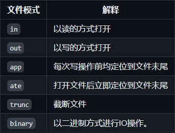

## I/O library

- `istream`: Input stream type that provides input operations.

- `ostream`: Ouput stream type that provides input operations.

- `cin`: An `istream` object that reads data from standard inputs

- `cout`: An `ostream` object that writes data to the standard output.

- `>>`: Used to read input data from an `istream` object.

- `<<`: Used to write output data to an `ostream` object.

- `getline`函数： Reads a line of data from a given `istream` object into a given string object.

  ```c++
  std::istream& getline(std::istream& input, std::string& str);
  // case
  std::getline(std::cin, line);
  ```

### I/O type in STL

`iostream`: reading or writing data from standard stream, such as `istream`, `ostream`

`fstream`: reading data from files, `ifstream`, `ofstream`

`sstream`: reading data from string, `istringsatream`, `ostringstream`

### I/O objects cannot be copied or assigned

1. **I/O object can't exist in container**
   IO objects like (`std:cin`, `std:cout`) are irreproducible, so they can't exists in containers like `std:vector` , `std:list`
2. **Formal parameters and return types also cannot be stream types**
   Because I/O **objects** cannot be copied, they cannot be used as arguments or return values for functions. This means that you can't define a function that accepts or returns an I/O **object** because that would attempt to copy the I/O object.
3. **Formal parameters and return types are generally references to streams**
   Since I/O objects cannot be copied, functions usually pass I/O objects by **reference**. This avoids the copying problem while allowing the function to manipulate the passed I/O object directly.
4. **Reading and writing an I/O object changes its state, so the reference passed and returned cannot be const**
   Reading and writing I/O objects changes their internal state, such as file pointer locations, error flags, and so on. Therefore, you cannot use the `const` modifier when you pass or return a reference to an I/O object. Using `const` restricts modifications to the state of the object, which is inappropriate when dealing with I/O operations.

```c++
#include <iostream>
#include <fstream>

// function accepts a non-const I/O stream reference as a parameter
void readLine(std::istream& input) {
    std::string line;
    std::getline(input, line);
    std::cout << "You entered: " << line << std::endl;
}

int main() {
    // Read a line from standard input
    std::cout << "Enter a line of text: ";
    readLine(std::cin);

    // Read a line from a file
    std::ifstream file("example.txt");
    if (file.is_open()) {
        readLine(file);
        file.close();
    } else {
        std::cerr << "Unable to open file";
    }

    return 0;
}
```

In this case:

1. The `readLine` function accepts an `std::istream&` (**a reference to the input stream**) as an argument. This avoids copying I/O objects.
2. Reading and writing `input` changes its state, e.g. reading the position, so `input` cannot be a `const` reference.
3. In the `main` function, we read a line of data from standard input and a file, respectively, and pass it by reference to the `readLine` function.

### condition state


In the table above, `strm` is an IO type, (like `istream`) and `s` is a stream object.

### File I/O

The header file `fstream` defines three types to support file IO:

- `ifstream` reads data from a given file.
- `ofstream` writes data to a given file.
- `fstream` can read and write the given file.

```c++
#include <iostream>
#include <fstream>
#include <string>

int main() {
    // Write data to a file using ofstream
    std::ofstream outFile("example.txt");
    if (outFile.is_open()) {
        outFile << "This is a line of text.\n";
        outFile << "This is another line of text.\n";
        outFile.close();
    } else {
        std::cerr << "Unable to open file for writing";
    }

    // Reading data from a file using ifstream
    std::ifstream inFile("example.txt");
    if (inFile.is_open()) {
        std::string line;
        while (std::getline(inFile, line)) {
            std::cout << line << std::endl;
        }
        inFile.close();
    } else {
        std::cerr << "Unable to open file for reading";
    }

    // Reading and writing files with fstream
    std::fstream file("example.txt", std::ios::in | std::ios::out | std::ios::app);
    if (file.is_open()) {
        // Additional line of text
        file << "Appending a new line of text.\n";

        // Move the file pointer to the beginning of the file
        file.seekg(0);

        // Read the contents of the file
        std::string line;
        while (std::getline(file, line)) {
            std::cout << line << std::endl;
        }
        file.close();
    } else {
        std::cerr << "Unable to open file for reading and writing";
    }

    return 0;
}
```

### fstream-specific operation


### file mode



### String stream

The header file `sstream` defines three types to support memory IO:

- `istringstream` reads data from `string`.
- `ostringstream` writes data to `string`.
- `stringstream` can read and write the given `string`.

```c++
#include <iostream>
#include <sstream>
#include <string>

int main() {
    // Writing to a String with ostringstream
    std::ostringstream oss;
    oss << "This is a line of text.\n";
    oss << "This is another line of text.\n";
    std::string outStr = oss.str(); // 获取写入的字符串
    std::cout << "Output string:\n" << outStr << std::endl;

    // Reading data from a string using istringstream
    std::istringstream iss(outStr);
    std::string line;
    std::cout << "Reading from string:" << std::endl;
    while (std::getline(iss, line)) {
        std::cout << line << std::endl;
    }

    // Reading and writing strings with stringstream
    std::stringstream ss;
    ss << "Initial text.\n";
    ss << "More text.\n";
    std::string readStr;
    std::cout << "Reading and writing with stringstream:" << std::endl;
    while (std::getline(ss, readStr)) {
        std::cout << readStr << std::endl;
    }
    ss.clear(); // Clear the error flag
    ss << "Appending new text.\n";
    ss.seekg(0); // Go back to the beginning of the string
    while (std::getline(ss, readStr)) {
        std::cout << readStr << std::endl;
    }

    return 0;
}
```

