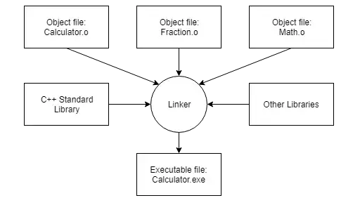

# C++学习笔记

# How C++ work

C++ can translate to machine code directly. And in compiler, .cpp file can be translate to a .obj file after compiling, .h file doesn’t be compile. Linker’s job is wire up functions, it takes .obj file to .exe

There is no file in c++, c++ don’t care of it, all of .cpp file be compiled into .obj. And include<iostream> make file big.

## include

#include just copy code and paste it.

# How linker work

the error “LNK” is a kind of link error. 

- First, linker take all the object files generated by the compiler and combine them into a single executable program.


- Second, in addition to being able to link object files, the linker also is capable of linking library files. A **library file** is a collection of precompiled code that has been “packaged up” for reuse in other programs.

## link error

if linker can not find a function or there are many same functions, it will have a link error.

for example:

```csharp
//Log.cpp
void Log(const char* message, int a) {
	std::cout << message << std::endl;
}

//main.cpp
void Log(const char* message);
int main() {
	int arr[7] = { 1,2,3,4,5,6,7 };
	int* p;
	p = arr;
	(*p++)++;
	Log("Hello world"); //in this line, linker cannot find a Log(const char*))
	cout << p << endl;
	return 0;
}
```

or

```csharp
//Log.h
void Log(const char* message) {
	std::cout << message << std::endl;
}

//Log.cpp
#include <iostream>
#include "Log.h"

//main.cpp
#include "Log.h" //include just copy and paste
void Log(const char* message);
int main() {
	//1>main.obj : error LNK2005: "void __cdecl Log(char const *)" (?Log@@YAXPBD@Z) 已经在 Log.obj 中定义
	//1>D:\A工作区\C++\learn-space\firstCpp\Debug\firstCpp.exe : fatal error LNK1169: 找到一个或多个多重定义的符号
	Log("Hello world"); //这里就会有link error
	return 0;
}
```

正常的做法是，用Log.cpp定义具体的函数体，然后再头文件中定义对Log.cpp中函数的引用，然后再在具体的类中使用include<Log.h>

```csharp
//Log.h
#include "Log.h"

//Log.cpp
#include <iostream>
void Log(const char* message) {
	std::cout << message << std::endl;
}

//main.cpp
#include "Log.h"
int main() {
	Log("Hello world"); //这里就会有link error
}
```

## Dynamic linker

动态链接器（Dynamic Linker）是一个在程序运行时（runtime）负责加载和链接共享库（shared libraries）的系统软件组件。这是现代操作系统中一个复杂但至关重要的部分。以下是动态链接器的工作原理的简要概述：

1. **加载程序时的动态链接**：
   - 当一个可执行文件（比如一个程序或者应用）启动时，操作系统首先将其加载到内存中。
   - 动态链接器检查可执行文件的头部信息，确定它依赖哪些共享库。
   - 动态链接器然后加载这些共享库（如果它们还没有在内存中的话）。这些共享库通常是`.so`（Linux）或`.dll`（Windows）文件。
2. **解析符号和地址**：
   - 每个共享库包含一系列的符号（symbols），比如函数和变量的名称。
   - 动态链接器解析这些符号的地址。这意味着它确定每个符号在内存中的具体位置。
   - 当程序调用一个在共享库中的函数时，动态链接器确保这个调用被重定向（redirect）到正确的内存地址。
3. **懒惰链接（Lazy Linking）**：
   - 在某些系统中，动态链接器采用“懒惰链接”策略。这意味着它只在符号第一次被访问时才解析其地址。
   - 这可以提高程序启动速度，因为并不是所有的符号都需要立即解析。
4. **符号重定位（Relocation）**：
   - 由于共享库可以被加载到内存的任意位置，动态链接器需要调整（relocate）库中符号的地址，使其反映它们在内存中的实际位置。
5. **全局偏移表（GOT）和程序链接表（PLT）**：
   - 在一些实现中，动态链接器使用全局偏移表（GOT）和程序链接表（PLT）来管理外部函数调用。
   - GOT用于存储符号的实际地址，而PLT用于处理函数调用的初始阶段。
6. **处理版本控制和兼容性**：
   - 动态链接器还负责处理库版本控制，确保程序使用的是正确版本的共享库。
   - 它还可能执行一些兼容性检查，以确保库与程序兼容。

# visual stdio debug

we can use debug window in visual stdio, and see what is in memory.


We also can use “disassembly” to check 汇编代码


## Visual Stdio 文件目录设置

把solution放在一个单独的文件夹中， 将输出中间文件 和输出文件放在bin中，并分成两个文件夹


# pointer and &

“&” can help you to get address of variable;

```cpp
//pointer
	int y = 100;
	int *x;
	x=&y; // get address
	cout << x << endl;

	y=500;
	cout << x <<endl;

//out
0x84ff9ff794
0x84ff9ff794
```

***x = &y ⇒ x is the address of y, while *x is the value of y**

```cpp
int x[5] = {1,2,3,4,5};
int *q,*p = &x[0];

q=p;
for(int i = 0; i<5; i++){
	int a = (*q++)++;
	cout << *q << endl;
	cout << q << endl;
}
```

以上代码的解释：

> 在C++中，**`(*p++)++`** 是一个表达式，涉及指针和递增运算符。让我们逐步解释这个表达式的含义：
> 
> 1. **`p`** 是一个指针，它指向某个数据类型的对象。
> 2. **`p`** 表示对指针 **`p`** 指向的对象进行解引用，即获取指针所指向位置的值。
> 
> 现在，让我们分析整个表达式 **`(*p++)++`** 的执行过程：
> 
> 1. **`(*p++)`**：
>     - **`p++`** 是后缀递增运算符，它会先使用 **`p`** 的值，然后再将 **`p`** 的值增加 1，即指向下一个位置。
>     - **`p`** 表示对当前 **`p`** 指向的位置进行解引用，获取该位置的值。
>     
>     因此，**`(*p++)`** 将首先解引用 **`p`** 指向的位置的值，然后将 **`p`** 指向下一个位置。
>     
> 2. **`++`**：
>     - 这是前缀递增运算符，它会将前面 **`(*p++)`** 的结果再加 1。
> 
> 综合起来，**`(*p++)++`** 的执行过程是：
> 
> - 首先，解引用 **`p`** 指向的位置，获取该位置的值。
> - 然后，将 **`p`** 指向下一个位置。
> - 最后，将前面获取的值加 1。
> 
> 请注意，这种代码可能会导致代码可读性变差，建议尽量避免编写复杂的表达式，以确保代码的清晰和易读性。
> 
> 下面再给出关于(*p++)++的汇编代码
> 
> ```csharp
> mov	eax, DWORD PTR _p$[ebp]
> mov	ecx, DWORD PTR [eax]
> add	ecx, 1 //先增加值
> mov	edx, DWORD PTR _p$[ebp]
> mov	DWORD PTR [edx], ecx
> mov	eax, DWORD PTR _p$[ebp]
> add	eax, 4 //再移动位置
> mov	DWORD PTR _p$[ebp], eax
> ```
> 

## void*

void pointer type can point to the address of any types of variable. But void pointer cannot be dereferenced, (int *)p == p;  *(int *)p = *p;  **When you define a void* , you must translate it to specific type when you use it.**

```cpp
int a =5;
void *p = &a;

cout << *(int*)p << endl;
```

## void**

pointer store the address of variable, so the pointer to pointer store the address of pointer.

---

<aside>
💡 关于Singleton& singletonInstance = Singleton::getInstance(); 前面的类型后面为什么要加&：

**在这段代码中，`Singleton& singletonInstance` 定义了一个引用变量 `singletonInstance`，它引用了一个名为 `Singleton` 的类的实例。**

**在 C++ 中，引用（`&`）用于创建一个别名，它允许你在代码中使用一个变量名来访问另一个已经存在的对象，而不是创建一个新的副本。在这种情况下，`Singleton& singletonInstance` 声明了一个引用，该引用可以引用 `Singleton` 类的实例。**

**通过 `Singleton::getInstance()` 函数获取 `Singleton` 类的实例，并将其赋给 `singletonInstance` 引用。这样，你就可以通过 `singletonInstance` 引用来访问 `Singleton` 类的实例，而不需要复制该实例的内容。**

**使用引用的好处是避免了对象的复制，提高了程序的效率，同时确保操作的是同一个对象实例。**

**如果不加 `&`，则 `Singleton& singletonInstance` 将被解释为声明一个对象而不是引用。这意味着在这种情况下，你将创建一个新的 `Singleton` 类的实例，并将其复制给 `singletonInstance`，而不是引用现有的实例。**

**示例代码如下：**

```cpp
Singleton singletonInstance = Singleton::getInstance();  // 创建并复制 Singleton 实例

```

**这样，`singletonInstance` 将成为一个新的 `Singleton` 类的实例的副本，而不是引用原有的实例。如果你在代码中对 `singletonInstance` 进行操作，会操作这个新创建的实例，不会影响原有的 `Singleton` 实例。**

**通常情况下，在单例模式中，我们希望通过引用来操作单例对象，以确保我们始终在操作同一个实例，而不是创建新的实例。因此，在单例模式中，通常会使用引用或指针来获取单例实例。**

</aside>

# Reference

和指针配合使用

```csharp
void Add(int* p)
{
	(*p)++;
}
int main() {
	int a = 10;
	Add(&a);
	Log(a);
}
```

```csharp
void Add(int& p)
{
	p++;
}

int a = 10;
	Add(a);
```

以上两个代码是一模一样的

# Class

## what’s the different in class and struct

in struct everything is public, but in class we can define “private” and “public” to variable or method.

if we just want to store simple data, we can use struct, like **Vector**

# Static in C++ & C#

在C++和C#中，`static` 关键字具有不同的含义和用法。

## C++

在C++中，`static` 关键字用于表示以下几种情况：

1. **静态变量 (static variables)**:
   在函数内部声明的变量，其生命周期与程序的运行周期相同。静态变量在首次声明时被初始化，之后的函数调用会保持该变量的值。
   
    ```cpp
    void foo() {
        static int count = 0;
        count++;
        std::cout << "Count: " << count << std::endl;
    }
    
    ```
   
2. **静态函数 (static functions)**:
   函数前加 `static` 关键字，使其具有内部链接，只能在当前文件中访问。
   
    ```cpp
    static void staticFunction() {
        // Function code
    }
    
    ```
   
3. **静态数据成员 (static data members)**:
   类的所有对象共享同一个静态数据成员。这个静态数据成员属于类，而不是属于类的对象。
   
    ```cpp
    class MyClass {
    public:
        static int staticDataMember;
    };
    
    int MyClass::staticDataMember = 10;  // Initialization of static data member
    
    int main() {
        std::cout << MyClass::staticDataMember << std::endl;  // Accessing static data member
        return 0;
    }
    
    ```
   

## C#

在C#中，`static` 关键字用于表示以下几种情况：

1. **静态类 (static class)**:
   使用 `static` 修饰的类是静态类，其中的成员也必须是静态的。静态类不能被实例化，且所有成员可以直接通过类名访问。
   
    ```csharp
    public static class StaticClass {
        public static int StaticMember { get; set; }
        public static void StaticMethod() {
            // Method code
        }
    }
    
    ```
   
2. **静态方法 (static methods)**:
   使用 `static` 修饰的方法是静态方法，可以直接通过类名调用，而不需要实例化对象。
   
    ```csharp
    public class MyClass {
        public static void StaticMethod() {
            // Method code
        }
    }
    
    ```
   
3. **静态字段 (static fields)**:
   使用 `static` 修饰的字段是静态字段，它们属于类而不是类的实例。所有类的实例共享相同的静态字段。
   
    ```csharp
    public class MyClass {
        public static int StaticField;
    }
    
    ```
   

总结来说，在C++中，`static` 主要用于静态变量、静态函数和静态数据成员，而在C#中，`static` 用于静态类、静态方法和静态字段。

# C++ 类型转换

C++中有多种类型转换方法，可以根据不同的需求选择适当的转换方式。以下是常用的类型转换方法：

1. **静态转换（static_cast）**：
   `static_cast` 用于执行非多态类型的转换，例如数值类型之间的转换、指针类型的转换等。它在编译时进行类型检查，不进行运行时检查。
   
    ```cpp
    double d = 3.14;
    int i = static_cast<int>(d);  // 将 double 转换为 int
    
    ```
   
2. **动态转换（dynamic_cast）**：
   `dynamic_cast` 用于执行含有虚函数的类层次结构中的安全向下转型。它在运行时进行类型检查，只能用于多态类型之间的转换。
   
    ```cpp
    class Base {
        virtual void foo() {}
    };
    
    class Derived : public Base {};
    
    Base* basePtr = new Derived();
    Derived* derivedPtr = dynamic_cast<Derived*>(basePtr);  // 安全向下转型
    
    ```
   
3. **常量转换（const_cast）**：
   `const_cast` 用于添加或移除变量的 const 限定符。它可以将常量转换为非常量，反之亦然。
   
    ```cpp
    const int num = 10;
    int* nonConstPtr = const_cast<int*>(&num);  // 将常量指针转换为非常量指针
    
    ```
   
4. **重新解释转换（reinterpret_cast）**：
   `reinterpret_cast` 用于低级别的转换，它可以将任何指针类型转换为任何其他指针类型。通常用于处理底层的转换，风险较高，需谨慎使用。
   
    ```cpp
    int i = 10;
    double* ptr = reinterpret_cast<double*>(&i);  // 将 int 指针转换为 double 指针
    
    ```
   

这些类型转换操作要慎用，尤其是 `reinterpret_cast` 和 `const_cast`，因为它们可能会引入程序错误或不可预知的行为。在使用类型转换时，应谨慎考虑程序的设计和安全性。

# Array

- 📝 动态分配数组
介绍了使用 `new` 关键字动态分配数组内存，并对比了动态分配和静态分配的区别以及需要注意的内存释放问题。
- 📝 指针与数组
  讨论了数组与指针的关系，以及如何通过指针操作数组元素，包括使用指针算术进行数组元素的访问。
  
    ```cpp
    int example[5];
    	example[0] = 5;
    	int* ptr = example;
    
    	//*(ptr + 2) = 6;
    	*(int*)((char*)ptr + 8) = 6;
    ```
  
- 使用标准数组
  提及了 C++11 中引入的 `std::array` 数据结构，与传统数组相比具有更多优势。
  
    ```cpp
    #include<array>
    
    array<int,5> arr = {0,1,2,3,4};
    int len = arr.size();
    ```
  
- 🧾 在堆上分配数组，无法直接获取大小,在堆上分配数组后，无法通过类似 "example.size" 的方式获取大小.在堆上分配数组后，删除数组时需要知道分配的内存大小,堆上数组的大小可能存储在负索引位置
- 🧾 分配数组在栈上时，可以通过获取数据类型大小和元素数量计算大小, 栈上数组的大小是元素数量而非字节数
- 🧾 静态数组大小需在编译时已知
- 🧾 推荐使用常量来管理数组大小
- 🧾 标准数组（std::array）是更安全的选择，但可能有额外开销
- 🧾 原始数组（raw arrays）可能更快，但不如标准数组安全

# 字符串

## 字符串是如何工作的

```cpp
static const char* name = "Russell";
cout << name[2] << endl;
//等同于以下代码
char name2[9] = { 'R','u','s','s','e','l','l',0 };
```

字符串实际上是一个字符数组，以\0结束

std::string就是在这基础上做了一层封装，实际上是一个东西

# Const

1. 第一种用法：规定某一个变量不可修改
   
    ```cpp
    const int a = "xxx";
    ```
    
2. 第二种用法，设定指针不可修改的部分
   
    ```cpp
    //1.这种写法a指针是完全不能修改的
    const int* a = new int; // = int const* a = new int;
    //2.这种写法a指针可以修改值但不能修改指向的位置
    int* const b = new int;
    *b = 3; // 可以修改值
    //*b = &9; //但不能修改指针所指向的位置
    ```
    
3. 给函数添加限定，使作用域内的变量不能被修改，其实任何一个不需要修改值的函数都应该增加const, 但是可以通过给变量增加mutable限定符，使变量在const作用域中可以被修改
   
    ```cpp
    string& MyClass::MyFunc() const
    {
    	return name;
    }
    ```
    
    # Mutable
    
    1. 上述用法
    2. 在lambda表达式中使用
       
        ```cpp
        int x = 0;
        	auto f = [=]() mutable //传值进去
        	{
        		x++;
        		cout << x << endl;
        	};
        ```
        
    
    # 构造函数列表
    
    ```cpp
    class MyClass
    {
    public:
    	Example example;
    	int a;
    	int b;
    public:
    	//这就是构造函数列表
    	MyClass(Example ex, int a, int b):example(ex),a(a),b(b)
    	{
    		
    	}
    	string MyFunc() const;
    private:
    	string name;
    };
    ```
    
    ```cpp
    class MyClass
    {
    public:
    	Example example;
    public:
    	MyClass()
    	{
    		//不要这么写
    		example = Example(8);
    	}
    	string MyFunc() const;
    private:
    	string name;
    };
    ```
    
    上述两个代码块其实是两种功能，第二个代码块会执行两次Example构造函数，一个是默认的，一个是带参数的
    
    # C++ 两种创建对象的方式
    
    1. 第一种方式：这种方式会在堆栈中创建对象，所以我们不需要去管内存的释放，这种方式是比较安全的，也是效率比较高的，所以**非常推荐用这种方式创建对象！！！**
    
    ```cpp
    A a("XX")
    ```
    
    1. 第二种方式实在堆中，在堆中的对象需要自己手动释放，堆比较大，适用于创建大量的对象的情况，但是这种方式不安全，可能造成内存泄漏。可以考虑用智能指针替换
       
        ```cpp
        A* a = new A("XX);
        ```
        
    
    # 隐式转换
    
    ```cpp
    class MyTest
    {
    private:
    	int name; // Explicit int name 这种方式就必须显示调用constructor
    	string age;
    public:
    	MyTest(int n) :name(n) {}
    	MyTest(const string& a) :age(a) {}
    };
    
    void PrintAge(const MyTest& test)
    {
    	cout << "asdasdasd" << endl;
    }
    
    int main() {
    	//隐式转换
    	MyTest test = 22;
    
    	//这种写法其实会需要两种转换"afasd"本质是一个字符数组，它需要先转换成string，
    	// 然后在隐式转换调用构造函数，而隐式转换只允许发生一次
    	//PrintAge("afasd"); 
    
    	//这种是可以的
    	PrintAge(MyTest("asdasd"));
    }
    ```
    
    但是如果使用了Explicit关键词，隐式就不起作用了
    
    # this指针
    
    - 📚 理解C++中的this关键字
        - 在C++中介绍了this关键字，它是一个指向当前对象实例的指针，只能通过成员函数访问。
        - 解释了this关键字的作用，以及如何在方法中使用this来访问类的成员变量。
    - 📚 使用this指针进行成员变量赋值
        - 探讨了如何通过this指针来解决成员变量与参数同名的问题，实现成员变量赋值。
        - 演示了使用this指针访问类的成员变量并进行赋值的示例。
    - 📚 理解const函数和this指针
        - 介绍了在const函数中使用this指针，以及this指针的类型在const和非const函数中的区别。
        - 解释了在const成员函数中，this指针的类型为常量指针，而非const成员函数中为普通指针。
        
        ```cpp
        class MyClass {
        public:
            int getValue() const {
                // 在const成员函数中，this指针的类型为const MyClass*
                // 不能通过this指针修改对象的成员变量
                // this->value = 10; // Error: Cannot modify a const object
                return value;
            }
        
        private:
            int value;
        };
        
        ---------------------------------------------------------------
        
        class MyClass {
        public:
            void setValue(int newValue) {
                // 在非const成员函数中，this指针的类型为MyClass*
                // 可以通过this指针修改对象的成员变量
                this->value = newValue;
            }
        
        private:
            int value;
        };
        ```
        
    - 📚 his指针用于调用类外函数
        - 讲解了如何使用this指针在类内部调用类外部的函数，传递当前类的实例作为参数。
        - 演示了通过this指针调用类外部函数的方法，并讨论了传递常量引用的情况。
        
        ```cpp
        #include <iostream>
        
        class MyClass {
        public:
            MyClass(int value) : value(value) {}
        
            void callExternalFunction() {
                // 使用this指针调用外部函数，并传递当前对象实例作为参数
                externalFunction(*this);
            }
        
            int getValue() const {
                return value;
            }
        
        private:
            int value;
        };
        
        // 外部函数，接受MyClass对象的引用作为参数
        void externalFunction(const MyClass& obj) {
            std::cout << "External function called with value: " << obj.getValue() << std::endl;
        }
        
        int main() {
            MyClass obj(42);
            obj.callExternalFunction();
        
            return 0;
        }
        ```
        
    - 📚 特殊用途与注意事项
        - 探讨了this指针的一些特殊用途，例如delete this，强调了避免使用这种用法的重要性。
        - 提示了避免在成员函数中调用delete this的危险，以及建议避免这种做法的理由。
        
        # Stack
        
        objects in stack can be destroyed automatically, but in heap, they can’t. We can write a class to help us destroy ptr automatically
        
        ```cpp
        class ScopePtr
        {
        public:
        	ScopePtr(Entity* e);
        	~ScopePtr();
        
        private:
        	Entity* ePtr;
        };
        
        ScopePtr::ScopePtr(Entity* e) :ePtr(e)
        {
        }
        
        ScopePtr::~ScopePtr()
        {
        	delete ePtr;
        }
        ```
        
        # Smart Pointer
        
        Smart Pointer can help us allocate and release memory automatically, but we still should pay attention to some points.
        
        ## shared_ptr
        
        we should be careful about circular references. It can cause memory leak.
        
        like this:
        
        ```cpp
        #include <iostream>
        #include <memory>
        
        class Node {
        public:
            Node() { std::cout << "Node constructor" << std::endl; }
            ~Node() { std::cout << "Node destructor" << std::endl; }
        
            // 持有对另一个Node的shared_ptr
            std::shared_ptr<Node> next;
        };
        
        int main() {
            std::shared_ptr<Node> node1 = std::make_shared<Node>();
            std::shared_ptr<Node> node2 = std::make_shared<Node>();
        
            // 创建循环引用
            node1->next = node2;
            node2->next = node1;
        
            return 0;
        }
        ```
        
        ## weak_ptr
        
        we can use weak_ptr to test if the shared_ptr existed. Because weak_ptr don’t increase the reference count.
        
        There is an example that using weak_ptr to check shared_ptr
        
        ```cpp
        #include <iostream>
        #include <memory>
        
        int main() {
            std::shared_ptr<int> sharedPtr = std::make_shared<int>(42);
            std::weak_ptr<int> weakPtr(sharedPtr);
        
            // 尝试将 weak_ptr 转换为 shared_ptr
            if (auto shared = weakPtr.lock()) {
                std::cout << "Value from weak_ptr: " << *shared << std::endl;
            } else {
                std::cout << "Object no longer exists." << std::endl;
            }
        
            return 0;
        }
        ```
        
        # Vector
        
        vector is a dynamic array, it can expand its size dynamically. But we still need to pay attention to some points to optimize the usage of vector:
        
        1. we can declare the size we want to use.
           
            ```cpp
            std::vector<Vertex> vertextes(4);
            ```
            
        2. we can replace `push_back` by `emplace_back` 
           
            ```cpp
            vertextes.emplace_back(1,2,3);
            ```
            
        
        # work with Library
        
        dll: dynamic link library, dll is a library which link resource on runtime
        
        lib: static library, the reference just be put into the project, it will be linked when it is compiled.
        
        firstly, we need to config the path of the lib. `$(SolutionDir)` is prefixes for path
        
        
        
        # Return type from func
        
        In C++, you can return objects from functions just like you can return other data types. Here's an example of how to do it:
        
        ```cpp
        #include <iostream>
        #include <string>
        
        class MyClass {
        public:
            MyClass(const std::string& value) : data(value) {}
        
            void displayData() {
                std::cout << "Data: " << data << std::endl;
            }
        
        private:
            std::string data;
        };
        
        MyClass createObject(const std::string& value) {
            MyClass newObj(value);
            return newObj;
        }
        
        int main() {
            MyClass obj = createObject("Hello, World!");
            obj.displayData();
        
            return 0;
        }
        
        ```
        
        When a function returns an object, C++ uses a mechanism called Return Value Optimization (RVO) or Named Return Value Optimization (NRVO) to optimize the return process. These optimizations are intended to eliminate unnecessary object copying, so even though it looks like the object is being copied, in many cases, it's actually being optimized by the compiler to avoid the copy. This means that returning objects from functions is generally efficient and idiomatic in C++.
        
        ## what’s RVO and NRVO
        
        RVO and NRVO are two optimization methods used by c++ compiler. In order to eliminate unnecessary object copying.
        
        In RVO, the local object constructed directly in the memory location where the object is expected to be stored.
        
        NRVO is a specific case in RVO where the object in function has a name and compiler optimizes the return by reuse the same object when it can.
        
        ## how to return multiply variables from func
        
        There are many methods can return multiply variables, there is a good way to do it:
        
        ```cpp
        Student GetStudent()
        {
        	std::string str1 = "xjl";
        	std::string str2 = "male";
        	int age = 16;
        
        	Student std(str1, str2, age);
        	return std::move(std); //to eliminate unnecessary copying
        }
        
        int main()
        {
        	Student st = GetStudent();
        	std::cout << st.age << std::endl;
        }
        ```
        
        Also, we can use tuple to return variables in this case. Tuple is an ordered collection of variables. But it’s inconvenient to get element in it. We must use `get<index>` , but we can’t know what we get actually.
        
        ```cpp
        #include <tuple>
        
        std::tuple<std::string,std::string,int> MultiplyValueReturns()
        {
        	std::string str1 = "name";
        	std::string str2 = "gender";
        	int age = 26;
        
        	return std::make_tuple(str1, str2, age);
        }
        
        int main()
        {
        	auto result = MultiplyValueReturns();
        	std::cout << std::get<0>(result) << std::get<1>(result) << std::get<2>(result) << std::endl;
        }
        ```
        
        # template
        
        template likes Generic in C#, it is designed to work with different data types, the actual type is typically inferred from the argument when the function or class is used. 
        
        ```cpp
        template<typename T, int N>
        class ObjectPool
        {
        public:
        	ObjectPool() {};
        	~ObjectPool() {};
        	void GetMemberFromVector();
        	void InsertVector();
        
        private:
        	std::vector<T> vec;
        };
        
        template<typename T, int N>
        void ObjectPool<T, N>::GetMemberFromVector()
        {
        	for (int i = 0; i < N; i++)
        	{
        		std::cout << vec[i].age << std::endl;
        	}
        }
        
        template<typename T, int N>
        void ObjectPool<T, N>::InsertVector()
        {
        	for (int i = 0; i < N; i++)
        	{
        		vec.emplace_back("1", "male", 10+i);
        	}
        }
        
        int main()
        {
        	ObjectPool<Student,5> pool;
        	pool.InsertVector();
        	pool.GetMemberFromVector();
        }
        ```
        
        # Macros
        
        we can use macros to do some preprocess. And we also can define different preprocess for different model, such as debug and release.
        
        
        
        
        
        ```cpp
        #ifdef R_DEBUG
        #define Log(x) std::cout<<x << std::endl
        #else
        #define Log(x)
        #endif // R_DEBUG
        ```
        
        # Callback in C++
        
        There are three ways to implement callback function, such as Function Pointer, Functor and Lambda expression.
        
        `Function Pointer`  points a memory location where the function is, there is example:
        
        ```cpp
        typedef void(*Callback)(int);
        void OnListener(int a)
        {
        	std::cout << "value is: " << a << std::endl;
        }
        
        void AddListener(Callback callback,int value)
        {
        	callback(value);
        }
        
        int main()
        {
        	AddListener(OnListener, 100);
        }
        ```
        
        `Functor` 
        
        ```cpp
        #include <iostream>
        
        // 回调函数对象
        struct MyCallbackFunctor {
            void operator()(int value) {
                std::cout << "Callback called with value: " << value << std::endl;
            }
        };
        
        // 使用回调函数对象的函数
        void DoSomethingWithCallback(int value, MyCallbackFunctor callback) {
            // 做一些工作
            callback(value); // 调用回调函数对象
        }
        
        int main() {
            MyCallbackFunctor functor;
            DoSomethingWithCallback(42, functor);
            return 0;
        }
        ```
        
        Lambda expression, `[]` capture variable which is outside of the function
        
        ```cpp
        #include <iostream>
        
        // 使用 Lambda 表达式的函数
        void DoSomethingWithCallback(int value, const std::function<void(int)>& callback) {
            // 做一些工作
            callback(value); // 调用 Lambda 表达式
        }
        
        int main() {
            // 使用 Lambda 表达式作为回调
            DoSomethingWithCallback(42, [](int value) {
                std::cout << "Callback called with value: " << value << std::endl;
            });
            return 0;
        }
        ```
        
        ## [ ] in lambda
        
        In C++ lambda expressions, the square brackets `[]` are used to capture variables from the surrounding scope. The choice of what to capture and how to capture it depends on your specific requirements. There are three main capture modes:
        
        1. **Capture by Value**: `[variable]`
            - This captures a specific variable by value, which means that a copy of the variable is stored in the lambda.
            - Modifications to the captured variable inside the lambda do not affect the original variable in the outer scope.
            
            ```cpp
            int x = 42;
            auto lambda = [x](){
                std::cout << x << std::endl; // x is captured by value
            };
            
            ```
            
        2. **Capture by Reference**: `[&variable]`
            - This captures a specific variable by reference, which means that the lambda operates on the original variable in the outer scope.
            - Modifications to the captured variable inside the lambda will affect the original variable.
            
            ```cpp
            int y = 42;
            auto lambda = [&y](){
                y = 100; // y is captured by reference
            };
            
            ```
            
        3. **Capture All Variables by Value or Reference**: `[=]` or `[&]`
            - `[=]` captures all variables used inside the lambda by value.
            - `[&]` captures all variables used inside the lambda by reference.
            
            ```cpp
            int a = 10, b = 20;
            auto lambda1 = [=](){
                std::cout << a + b << std::endl; // a and b are captured by value
            };
            auto lambda2 = [&](){
                a = 100; // a and b are captured by reference
            };
            
            ```
            
        
        You can also mix and match capture modes for different variables within the same lambda expression. For example:
        
        ```cpp
        int a = 10, b = 20;
        auto lambda = [a, &b](){
            std::cout << a + b << std::endl; // a is captured by value, b is captured by reference
        };
        
        ```
        
        The choice of how to capture variables depends on the specific use case and whether you want to modify the original variables within the lambda or not.
        
        ## why should we use static in member function
        
        when we use member function for callback,  we should pass `this`  as a hidden argument to the callback function, since we should get the context to use member variables. But pass pointer `this` will cost a lot of performance. We need try to avoid this situation. 
        
        Static function only has one instance in whole project, we just need to find the location in memory where instruction is and use it. So we don’t need to pass pointer `this` 
        
        ```cpp
        #include <iostream>
        #include <functional>
        
        class CallbackHandler {
        public:
            void NonStaticCallback(int value) {
                std::cout << "Non-static callback called with value: " << value << std::endl;
            }
        };
        
        // 使用 std::function 作为回调函数的容器
        void UseCallback(int value, std::function<void(int)> callback) {
            callback(value);
        }
        
        int main() {
            CallbackHandler obj;
            
            // 使用 std::function 包装非静态成员函数
            std::function<void(int)> callback = std::bind(&CallbackHandler::NonStaticCallback, &obj, std::placeholders::_1);
        
            // 将包装后的回调函数传递给使用回调的函数
            UseCallback(42, callback);
            
            return 0;
        }
        ```
        
        # why not use namespace std
        
        <aside>
        💡 Never use namespace std on the head file!!!!
        
        </aside>
        
        and we need to know what we had used.
        
        # Thread
        
        Understanding how to use C++'s multithreading library and best practices in multithreaded programming is crucial. Below, I'll provide a brief overview of multithreading in C++ and provide examples to illustrate its applications.
        
        ### Multithreading in C++
        
        C++11 introduced multithreading support, which includes the `std::thread` class and other tools and features related to multithreading. With C++ multithreading, you can create, manage, and synchronize multiple threads to execute tasks in parallel or concurrently. Here are some key concepts in C++ multithreading:
        
        1. **`std::thread` Class**: `std::thread` is the C++ class used to create threads. You can use it to create new threads and run functions or callable objects.
           
            ```cpp
            #include <iostream>
            #include <thread>
            
            void threadFunction() {
                std::cout << "Hello from the new thread!" << std::endl;
            }
            
            int main() {
                std::thread t(threadFunction);
                t.join(); // Wait for the thread to finish
                std::cout << "Back in the main thread." << std::endl;
                return 0;
            }
            
            ```
            
        2. **Thread Synchronization**: Multithreaded programming can lead to race conditions and data races. C++ provides tools like mutexes (`std::mutex`) and condition variables (`std::condition_variable`) to help ensure thread safety.
           
            ```cpp
            #include <iostream>
            #include <thread>
            #include <mutex>
            
            std::mutex mtx;
            
            void threadFunction(int &counter) {
                for (int i = 0; i < 1000; ++i) {
                    std::lock_guard<std::mutex> lock(mtx);
                    counter++;
                }
            }
            
            int main() {
                int counter = 0;
                std::thread t1(threadFunction, std::ref(counter));
                std::thread t2(threadFunction, std::ref(counter));
            
                t1.join();
                t2.join();
            
                std::cout << "Counter: " << counter << std::endl;
                return 0;
            }
            
            ```
            
        3. **Parallel Computing**: C++ multithreading can be used to parallelize compute tasks, speeding up the processing of large data sets or compute-intensive tasks. For example, you can use `std::async` to launch asynchronous tasks.
           
            ```cpp
            #include <iostream>
            #include <vector>
            #include <future>
            
            int square(int x) {
                return x * x;
            }
            
            int main() {
                std::vector<std::future<int>> futures;
                for (int i = 0; i < 10; ++i) {
                    futures.push_back(std::async(std::launch::async, square, i));
                }
            
                for (auto &f : futures) {
                    std::cout << "Result: " << f.get() << std::endl;
                }
            
                return 0;
            }
            
            ```
            
        4. **Deadlocks and Performance Optimization**: Multithreaded programming requires careful handling of deadlocks and performance optimization. Understanding how to design multithreaded applications to avoid deadlocks and optimize performance is important.
        
        ### Example: Multithreaded Image Processing
        
        Suppose you need to process a large number of images, such as resizing and saving them. Using multithreading can significantly speed up the processing. Here's a simple example of multithreaded image processing using C++'s multithreading library:
        
        ```cpp
        #include <iostream>
        #include <thread>
        #include <vector>
        
        void processImage(const std::string &filename) {
            // Perform image processing
            std::cout << "Processing image: " << filename << std::endl;
            // Image processing code is omitted here
        }
        
        int main() {
            std::vector<std::string> imageFiles = {"image1.jpg", "image2.jpg", "image3.jpg", /*...*/};
            std::vector<std::thread> threads;
        
            for (const std::string &filename : imageFiles) {
                threads.push_back(std::thread(processImage, filename));
            }
        
            for (std::thread &t : threads) {
                t.join();
            }
        
            std::cout << "All images processed." << std::endl;
        
            return 0;
        }
        
        ```
        
        In this example, each image processing task is assigned to an independent thread, allowing multiple images to be processed simultaneously, thereby improving processing speed.
        
        In summary, C++ multithreading is a powerful tool for handling parallel and concurrent tasks. Using `std::thread`, thread synchronization mechanisms, and other related tools, you can harness the performance potential of multi-core processors. However, multithreaded programming requires careful handling of concurrency issues to avoid race conditions and deadlocks.
        
        # Timer
        
        ```cpp
        struct Timer
        {
        	std::chrono::time_point<std::chrono::steady_clock> begin, end;
        	std::chrono::duration<float> duration;
        
        	Timer()
        	{
        		begin = std::chrono::high_resolution_clock::now();
        	}
        
        	~Timer()
        	{
        		end = std::chrono::high_resolution_clock::now();
        		duration = end - begin;
        
        		auto dur = duration.count() * 1000.0f;
        		std::cout << "duration: " << dur << "ms" << std::endl;
        	}
        };
        ```
        
        Timer can be used for record time span.
        
        # 2d array
        
        build a normal 2d array is slow, since we should foreach every time.
        
        ```cpp
        //this way to build a 2d array is slow
        int** a2d = new int* [5];
        
        for (int i = 0; i < 5; i++)
        {
        	a2d[i] = new int[5];
        	for (int j = 0; j < 5; j++)
        	{
        		a2d[i][j] = 2;
        	}
        }
        
        std::cout << a2d[1][2] << std::endl;
        ```
        
        this way is fast
        
        ```cpp
        //this way is faster
        int* arr = new int[5 * 5];
        for (int i = 0; i < 5; i++)
        {
        	for (int j = 0; j < 5; j++)
        	{
        		arr[j + i * 5] = 2;
        	}
        }
        
        std::cout << arr[2+1*5] << std::endl;
        ```
        
        # Type running in c++
        
        ```cpp
        struct Entity
        {
        	int x,y;
        }
        
        int main()
        {
        	Entity e = {5,8};
        	int* position = (int*)&e; // type cast
        	std::cout << position << std::endl;
        }
        ```
        
        # Union
        
        union is a special type which can give different data types same memory spaces. It’s similar to a  struct in that it can contain different type, but only one member can contain a value at any given time. The size of the value is taken the largest member.
        
        ```cpp
        #include<iostream>
        using namespace std;
        
        union myUnion {
            int myInt;
            float myFloat;
            char myChar;
        };
        
        int main() {
            myUnion testUnion;
            testUnion.myInt = 3;
            cout << "myInt: " << testUnion.myInt << endl;
            
            testUnion.myFloat = 4.5;
            // Note: The value of myInt is undefined after assigning to myFloat
            cout << "myFloat: " << testUnion.myFloat << endl;
            
            testUnion.myChar = 'a';
            // Note: The value of myFloat and myInt is undefined after assigning to myChar
            cout << "myChar: " << testUnion.myChar << endl;
        		std::cout << "myInt: " << testUnion.myInt << std::endl;
        		std::cout << "myFloat: " << testUnion.myFloat << std::endl;
            
            return 0;
        }
        ```
        
        In the example above, **`myUnion`** is a union that can hold an **`int`**, a **`float`**, or a **`char`**. However, it can only hold one of these types at a time. When we assign a value to **`myFloat`**, the content of **`myInt`** becomes undefined because they share the `same memory location`. The same happens when we assign a value to **`myChar`**.
        
        Unions are useful in situations where you want to use the same memory space for different types, and you are sure about which type is stored in the union at any point in time. This can lead to more memory-efficient programs.
        
        For example: if we want to store data struct in one memory location, such as tcp and udp, if we use union, we don't need shift bits, it can be quicker and safer.
        
        # condition and action breakpoint
        
        
        
        # Casting in c++
        
        ## static cast
        
        static cast only performs conversion between compatible types. such as int, double, float
        
        ```cpp
        int a = 10;
        double b = static_cast<double>(a);
        std::cout << b << std::endl;
        b = 2.333;
        int c = static_cast<int>(b);
        std::cout << c << std::endl;
        ```
        
        ## dynamic cast
        
        dynamic cast is handling for polymorphism, we can use dynamic cast to downcast safely. It requires at least one of the classes in the hierarchy have a virtual function.
        
        ```cpp
        class Student
        {
        private:
        	int age;
        	std::string name;
        public:
        	virtual void Func() {}
        };
        
        class Undergradudate: public Student
        {
        	bool male;
        };
        
        int main()
        {
        	Student* stu = new Undergradudate();
        	Undergradudate* unStu = dynamic_cast<Undergradudate*>(stu);
        }
        ```
        
        ## const cast
        
        const cast is always used to eliminate cast, and the type in the const_cast must be a pointer or reference.
        
        ```cpp
        const int* f = new int(10);
        int* h = const_cast<int*>(f);
        ```
        
        ## reinterpret cast
        
        it can convert any types of pointer to any  other types of pointers, it’s unsafe
        
        ### **Best Practices:**
        
        - Prefer C++-style casts over C-style casts.
        - Use **`static_cast`** when you are converting between related types.
        - Use **`dynamic_cast`** for safely downcasting with polymorphic types.
        - Avoid using **`reinterpret_cast`** unless absolutely necessary.
        - Avoid using **`const_cast`**; reconsider your program’s design if you find yourself needing it frequently.
        - Avoid C-style and function-style casts for safer and more readable code.
    
    # Precompiled Headers
    
    - What is a precompiled header file: A precompiled header file can convert a set of header files into a format that the compiler can use directly, reducing compilation time.
    - 🚀 Benefits of using precompiled header files: Significantly improves compilation speed, especially in large projects.
    - 🛑 Do not put frequently modified files into the precompiled header file to avoid repeated recompilation.
    - 🌐 Best practices for using precompiled header files: Put infrequently modified and highly dependent files into the precompiled header file, such as standard library files and third-party library files.
    - 🛠 How to set up and use precompiled header files in Visual Studio and GCC.
    - 📈 The importance of precompiled header files in improving compilation efficiency.
    - ❓ Points to note when using precompiled header files, and how to avoid potential problems.
    - 🎯 Conclusion and a call to the audience to start using precompiled header files to enhance their development efficiency.
    
    # Structure Binding
    
    In c++17, we can use structure binding to accept the return from a func.
    
    ```cpp
    std::tuple<std::string, int> CreatePerson()
    {
    	return { "Russell",26 };
    }
    
    int main()
    {
    	auto[name, age] = CreatePerson();
    	std::cout << name << "," << age << std::endl;
    }
    ```
    
    # std::optional
    
    `std::optional` is a feature introduced in C++17 that provides a way to represent optional values, which can be especially useful when a function may or may not return a valid result. `std::optional` can be thought of as a type-safe, better alternative to using raw pointers or special sentinel values to indicate the absence of a value.
    
    Here is a quick summary and example of how to use `std::optional`:
    
    ### Including the Header
    
    To use `std::optional`, you need to include the header:
    
    ```cpp
    #include <optional>
    
    ```
    
    ### Basic Usage
    
    You can create an `std::optional` object like this:
    
    ```cpp
    std::optional<int> maybeNumber;
    
    ```
    
    This creates an optional that doesn’t contain a value. You can check if it contains a value using the `has_value()` member function or the `operator bool()`:
    
    ```cpp
    if (maybeNumber) {
        std::cout << "The number is " << maybeNumber.value() << '\\n';
    } else {
        std::cout << "The number is not set.\\n";
    }
    
    ```
    
    You can assign a value to it like this:
    
    ```cpp
    maybeNumber = 42;
    
    ```
    
    And you can retrieve the value using the `value()` function, but be careful – calling `value()` on an empty `std::optional` will throw a `std::bad_optional_access` exception:
    
    ```cpp
    int number = maybeNumber.value();  // OK, maybeNumber contains a value
    
    ```
    
    Alternatively, you can use `value_or(default_value)` to retrieve the value or a default if it’s not set:
    
    ```cpp
    int number = maybeNumber.value_or(0);  // Returns 0 if maybeNumber is empty
    
    ```
    
    ### Creating Optional from a Function
    
    You can use `std::optional` as a return type for functions that may or may not produce a result:
    
    ```cpp
    std::optional<int> findNumber(const std::vector<int>& numbers, int toFind) {
        for (int number : numbers) {
            if (number == toFind) {
                return number;  // Found, return the number
            }
        }
        return {};  // Not found, return an empty optional
    }
    
    ```
    
    Usage:
    
    ```cpp
    std::vector<int> numbers = {1, 2, 3, 4, 5};
    auto result = findNumber(numbers, 3);
    if (result) {
        std::cout << "Number found: " << result.value() << '\\n';
    } else {
        std::cout << "Number not found.\\n";
    }
    
    ```
    
    ### In Place Construction
    
    You can also construct the value in place:
    
    ```cpp
    std::optional<std::string> maybeString(std::in_place, "Hello, World!");
    
    ```
    
    ### Resetting an Optional
    
    To clear the value of an optional, you can use the `reset()` function:
    
    ```cpp
    maybeNumber.reset();  // Clears the value
    
    ```
    
    ### Summary
    
    `std::optional` is a powerful tool in C++17 that helps to express the notion of an optional value in a type-safe manner. It helps to avoid using raw pointers or special sentinel values, making code safer and more expressive.
    
    # Variant
    
    `std::variant` is a feature introduced in C++17 that provides a type-safe way to store and manipulate values of different types. It can be thought of as a safer, more expressive alternative to a union.
    
    A `std::variant` can hold a value of one of the specified types, and it always holds a value (it's never empty, unless it holds a type that can be empty).
    
    Here's a quick guide and example of how to use `std::variant`:
    
    ### Including the Header
    
    To use `std::variant`, you need to include the header:
    
    ```cpp
    #include <variant>
    
    ```
    
    ### Basic Usage
    
    You can create a `std::variant` object by specifying the types it can hold:
    
    ```cpp
    std::variant<int, float, std::string> v;
    
    ```
    
    This creates a variant that can hold an `int`, a `float`, or a `std::string`. Initially, it holds a value of the first specified type (`int` in this case).
    
    You can assign values of the specified types:
    
    ```cpp
    v = 10;         // v holds an int
    v = 3.14f;      // v holds a float
    v = "Hello";    // v holds a std::string
    
    ```
    
    ### Visiting the Value
    
    To access the value in a type-safe manner, you can use `std::visit`:
    
    ```cpp
    std::visit([](auto&& arg) {
        using T = std::decay_t<decltype(arg)>;
        if constexpr (std::is_same_v<T, int>) {
            std::cout << "int with value " << arg << '\\n';
        } else if constexpr (std::is_same_v<T, float>) {
            std::cout << "float with value " << arg << '\\n';
        } else if constexpr (std::is_same_v<T, std::string>) {
            std::cout << "std::string with value " << arg << '\\n';
        }
    }, v);
    
    ```
    
    ### Checking the Type
    
    You can check the currently held type using `std::holds_alternative`:
    
    ```cpp
    if (std::holds_alternative<int>(v)) {
        std::cout << "The variant holds an int.\\n";
    } else if (std::holds_alternative<float>(v)) {
        std::cout << "The variant holds a float.\\n";
    } else if (std::holds_alternative<std::string>(v)) {
        std::cout << "The variant holds a std::string.\\n";
    }
    
    ```
    
    ### Accessing the Value Directly
    
    You can also access the value directly using `std::get`, but be careful – if you use `std::get` with a type that the variant doesn’t currently hold, an exception (`std::bad_variant_access`) will be thrown:
    
    ```cpp
    try {
        int i = std::get<int>(v);  // OK if v holds an int
    } catch (const std::bad_variant_access& e) {
        std::cerr << "Error: " << e.what() << '\\n';
    }
    
    ```
    
    You can also use `std::get_if` to access the value safely:
    
    ```cpp
    if (auto ptr = std::get_if<int>(&v)) {
        std::cout << "The variant holds an int with value " << *ptr << '\\n';
    } else {
        std::cout << "The variant does not hold an int.\\n";
    }
    
    ```
    
    ### Summary
    
    `std::variant` is a powerful and type-safe way to work with values of different types. It is a safer alternative to unions and provides more expressive ways to manipulate and access the values. The combination of `std::variant`, `std::visit`, and `std::get` provides a robust way to work with heterogeneous types in a type-safe manner.
    
    # any
    
    `std::any`是C++17中引入的一种类型，可以用来存储任何类型的值。`std::any`的实现通常使用了一种叫做“小对象优化”（Small Object Optimization, SSO）的技术，这种技术能够在对象较小的情况下避免动态内存分配。
    
    具体来说，`std::any`会在`栈上`预留一小块内存，用于存储小的对象。如果存储的对象大小超过这个预留的内存大小，`std::any`会进行动态内存分配来存储对象。
    
    所以，对于小型数据，`std::any`通常不会进行动态内存分配，而是直接在栈上存储数据。对于大型数据，`std::any`会进行动态内存分配。
    
    这里有个简单的例子来说明这一点：
    
    ```cpp
    #include <any>
    #include <iostream>
    #include <vector>
    
    int main() {
        std::any smallData = 42;  // 小对象，存储在栈上
        std::any largeData = std::vector<int>(1000, 42);  // 大对象，可能进行动态内存分配
    
        std::cout << "Done\\n";
        return 0;
    }
    
    ```
    
    在这个例子中，`smallData`存储了一个int类型的对象，它是一个小对象，通常会直接存储在`std::any`内部的预留空间中，不会进行动态内存分配。而`largeData`存储了一个`std::vector<int>`对象，它是一个大对象，可能会导致`std::any`进行动态内存分配。
    
    值得注意的是，具体多大的对象会触发动态内存分配取决于`std::any`的实现和平台的具体情况。C++标准并没有规定`std::any`必须使用小对象优化，也没有规定预留多少内存给小对象。所以不同的编译器和平台可能会有不同的行为。
    
    # String_view
    
    **`std::string_view`**是C++17中引入的一个非常有用的类模板。它为字符数组（通常是**`std::string`**或字符数组）提供了一个轻量级、不拥有的视图。这意味着**`std::string_view`**本身并不存储字符数据，而只是持有对现有字符数据的引用（通过一个指针和一个长度）。
    
    以下是**`std::string_view`**的一些关键点和优势：
    
    1. **性能优化**：它允许函数接受任何类型的字符串数据（**`const char*`**, **`std::string`**, 字符数组等）而不需要进行额外的内存分配或复制。
    2. **子字符串操作**：使用**`std::string_view`**可以轻松地、无需分配额外内存地获得字符串的子字符串。
    3. **与其他字符串类型兼容**：你可以使用**`std::string_view`**作为函数的参数类型，这样该函数就可以接受**`std::string`**、字符数组或**`const char*`**作为参数，无需进行额外的类型转换。
    4. **不拥有数据**：需要注意的是，**`std::string_view`**并不拥有它引用的数据。如果原始数据被销毁或超出作用域，而**`std::string_view`**仍然存在并尝试访问数据，那么会导致未定义的行为。
    5. **灵活性**：**`std::string_view`**可以轻松地转换为**`std::string`**，并提供了**`std::string`**的许多常用成员函数，如**`find`**, **`substr`**等。
    
    ## Small optimization in string
    
    in c++17, if you assign a short string (less than 15 bytes), there won’t be allocated.
    
    in c++ string, we can see the code, it judges the size of the string, if it is shorter than `_Mypair`, it will use an old buffer to store it.
    
    
    
    we can have an experiment:
    
    in release:
    
    ```cpp
    void* operator new(size_t size)
    {
    	std::cout << "Allocating" << std::endl;
    	return malloc(size);
    }
    
    int main()
    {
    	std::string name = "Russell";
    }
    ```
    
    
    
    there are no any allocate.
    
    ```cpp
    std::string name = "Russell asdasd asdasda asdasda dasdass";
    ```
    
    
    
    there is an allocate
    
    # Singleton in C++
    
    Singleton is a design pattern, in c++ , it used as like namespace. it can organize stuff in a class, but it just like a namespace. But there is still a  different between them. **Singleton is based on keyword “static”, this can make there is only one instance of Singleton class in whole project.**
    
    ```cpp
    class Singleton
    {
    public:
    	Singleton(const Singleton&) = delete;
    
    	static Singleton& Get()
    	{
    		static Singleton Instance;
    		return Instance;
    	}
    
    	void PrintHelloWorld();
    
    private:
    	Singleton() {};
    };
    
    void Singleton::PrintHelloWorld()
    {
    	std::cout << "Hello World" << std::endl;
    }
    
    ```
    
    actually a namespace also can achieve the function same as singleton , but it is more organized.
    
    ```cpp
    namespace Singleton
    {
    	void PrintHelloWorld()
    	{
    
    	}
    }
    ```
    
    # Memory Tracker
    
    design own memory tracker by overload operator new and delete.
    
    ```cpp
    struct TrackMemrory
    {
    	uint32_t TotalAllocated = 0;
    	uint32_t TotalFreed = 0;
    };
    
    static TrackMemrory _trackMemory;
    
    void* operator new(size_t size)
    {
    	_trackMemory.TotalAllocated += size;
    	return malloc(size);
    }
    
    void operator delete(void* memory, size_t size)
    {
    	_trackMemory.TotalFreed += size;
    	free(memory);
    }
    
    void PrintMemoryTrack()
    {
    	std::cout << _trackMemory.TotalAllocated << " and" << _trackMemory.TotalFreed << std::endl;
    }
    
    int main()
    {
    	PrintMemoryTrack();
    	{
    		std::string name = "Russell asdasd asdasda asdasda dasdass";
    	}
    	PrintMemoryTrack();
    }
    ```
    
    
    
    # lValue & RValue
    
    In C++, `lvalue` (left value) and `rvalue` (right value) are two main categories of expressions that describe the storage and identity characteristics of objects in memory.
    
    ### lvalue (left value)
    
    **Definition**: An `lvalue` refers to an expression that represents an object with a persistent state. In other words, an `lvalue` persists beyond the life of the expression, having a defined location in memory.
    
    **Characteristics**:
    
    - Can appear on the left-hand side of an assignment statement.
    - They represent objects or functions with a persistent address.
    - Typically can be referenced (you can take their address).
    
    **Examples**:
    
    ```cpp
    int x = 10;  // x is an lvalue
    int& ref = x; // ref is a reference to x, x must be an lvalue
    
    // Function returns a reference, hence an lvalue
    int& GetRef() {
        static int y = 10;
        return y;
    }
    
    GetRef() = 5; // OK, because GetRef returns an lvalue reference
    
    ```
    
    In this example, both `x` and `y` returned through `GetRef` are `lvalues` because they have a fixed position in memory.
    
    ### rvalue (right value)
    
    **Definition**: An `rvalue` refers to an expression that does not represent an object with a persistent state and usually represents temporary values that are not needed after their immediate use.
    
    **Characteristics**:
    
    - Cannot appear on the left-hand side of an assignment statement.
    - They are typically not referenceable (cannot directly take their address).
    - Often used to represent literals or expressions that return temporary objects.
    
    **Examples**:
    
    ```cpp
    int GetNumber() {
        return 42; // The returned 42 is an rvalue
    }
    
    int main() {
        int a = GetNumber(); // GetNumber() returns an rvalue
    
        int b = a + 2; // a + 2 yields an rvalue
    
        int&& rref = GetNumber(); // rref is a right value reference bound to an rvalue
    }
    
    ```
    
    In this example, the `42` returned by `GetNumber()` is an `rvalue` because it is a temporary value that does not require persistent storage. Similarly, the expression `a + 2` yields an `rvalue` because the result is temporary and does not have a fixed memory address.
    
    ### Lvalue References and Rvalue References
    
    C++11 introduced the concept of rvalue references, denoted with `&&`, which are particularly suited for managing temporary objects. They allow developers to safely move data from temporary objects, which is foundational for implementing move semantics and perfect forwarding.
    
    ```cpp
    void ProcessValue(int& lvalue) {
        std::cout << "LValue processed: " << lvalue << std::endl;
    }
    
    void ProcessValue(int&& rvalue) {
        std::cout << "RValue processed: " << rvalue << std::endl;
    }
    
    int main() {
        int x = 10;  // x is an lvalue
        ProcessValue(x); // Calls ProcessValue(int& lvalue)
        ProcessValue(20); // 20 is an rvalue, calls ProcessValue(int&& rvalue)
    }
    
    ```
    
    In this example, `x` is an `lvalue`, while the literal `20` is an `rvalue`.
    
    In summary, `lvalue` represents an object with a definite storage location, whereas `rvalue` represents a temporary or unnamed value that cannot be accessed directly via an identifier. Understanding the distinction between `lvalue` and `rvalue` is crucial for mastering advanced features in C++, such as move semantics and perfect forwarding.
    
    # C++ Tools
    
    Jenkins  -  continues integrations tool
    
    PVS-Studio - check semantic
    
    ReSharper C++
    
    # Move Constructor
    
    In C++, a move constructor and a move assignment operator were introduced in C++11. They allow the transfer of resources between objects without the expensive copy operations. This is particularly useful for managing dynamically allocated resources, such as memory, as it can significantly improve performance.
    
    The definition of a move constructor is as follows:
    
    ```cpp
    ClassName(ClassName&& other) noexcept {
        // Implement resource transfer here, typically involving swapping pointers
    }
    
    ```
    
    In the code above, `ClassName` is your class name, `&&` denotes an rvalue reference, and `other` is the object being moved.
    
    Here's an example demonstrating how to write a move constructor and how to use it:
    
    ```cpp
    #include <iostream>
    
    class MyString {
    private:
        char* data;
    
    public:
        // Constructor
        MyString(const char* str) {
            // Allocate memory and copy the string
            data = new char[strlen(str) + 1];
            strcpy(data, str);
        }
    
        // Move constructor
        MyString(MyString&& other) noexcept {
            // Transfer resources directly without copying
            data = other.data;
            other.data = nullptr;
        }
    
        // Destructor
        ~MyString() {
            delete[] data;
        }
    
        // Other member functions and operator overloads
    
        // Display the string
        void display() const {
            std::cout << data << std::endl;
        }
    };
    
    int main() {
        MyString str1("Hello");
        MyString str2(std::move(str1)); // Use the move constructor to transfer resources
        str1.display(); // Output is empty because the resources have been moved
        str2.display(); // Output is "Hello"
    
        return 0;
    }
    
    ```
    

# Make a data structure in C++

here we build a array with dynamic allocate. Using template can help us to assign typename and size dynamicly.

```cpp
template<typename T, size_t S>
class Array
{
public:
	constexpr size_t Size() const { return S; }
	T& operator[](size_t index) { return m_Data[index]; }
	const T& operator[](size_t index) const { return m_Data[index]; }
	T* Data() { return m_Data; }
private:
	T m_Data[S];
};

int main()
{
	int size = 5;
	Array<int, 5> arr;

	arr[1] = 2;
	const Array<int, 5> arrReference = arr;
	//note that memset() set size in memory, so we should give the sum of the size for whole memory. 
	memset(arr.Data(), 0, arr.Size() * sizeof(int));
	for (int i = 0; i < arr.Size(); i++)
	{
		std::cout << arr[i] << std::endl;
	}
}
```

# c++ Iterator

Iterator works like pointer, it overloads ‘++’, ‘- - ‘, ‘*’, ‘→’ operators, this can help iterator point to elements step by step.

```cpp
for(auto& it=vec.begin(); it!=vec.End(); it++)
{
		std::cout << *it << std::endl; //dereference
}
```