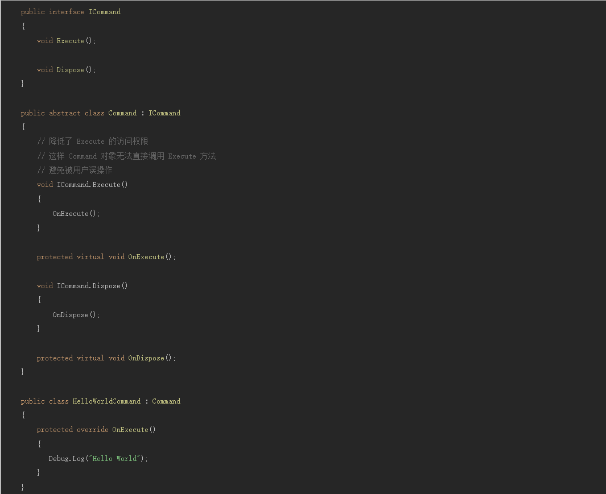

# C#知识体系

# C#1.0 总体概览

- 类
- 结构体
- 接口
- 事件
- 委托
- 属性器
- 表达式
- 语句
- 特性

# 类

## 引用类型和值类型

- 引用类型：class,string
- 值类型：除引用类型以外的类型
- 引用类型存储值得引用，值类型直接存储值

## 成员隐藏

子类使用new 修饰符，当子类要隐藏父类成员，但父类向下生成子类实例时，父类成员不会被隐藏；若子类生成子类实例时，父类成员会被隐藏

```csharp
using System;
namespace test
{
    public class Humanoid
    {
        public void Yell()
        {
            Console.WriteLine("Humanoid version of the Yell() method");
        }
    }
    
    public class Enemy1 : Humanoid
    {
        public new void Yell()
        {
            Console.WriteLine("Enemy1 version of the Yell() method");
        }
    }
    
    public class Enemy2 : Humanoid
    {
        public new void Yell()
        {
            Console.WriteLine("Enemy2 version of the Yell() method");
        }
    }

    class Program
    {
        static void Main(string[] args)
        {
            Humanoid human = new Humanoid();
            Humanoid enemy1 = new Enemy1();
            Enemy2 enemy2 = new Enemy2();
            human.Yell();
            enemy1.Yell();
            enemy2.Yell();
            Console.ReadKey();
        }
    }
}

//output:
//Humanoid version of the Yell() method
//Humanoid version of the Yell() method
//Enemy2 version of the Yell() method
```

## 封装性

Internal,private,public,protect

## Abstract，Interface，Virtual

### Virtual和Abstract的区别

- 抽象函数不能具有功能。基本上是在说，任何子类都必须提供自己的该方法的版本，但是它太笼统了，甚至无法尝试在父类中实现。
- 虚函数基本上是在说，看，这里的功能对于子类来说可能足够好，也可能不够好。因此，如果足够好，请使用此方法；否则，请覆盖我并提供您自己的功能。
- 接口：一个接口是定义的一组成员的引用类型。实现该接口的所有类和结构都必须实现该组成员。接口可以为这些成员中的任何一个或所有成员定义默认实现。一个类可以实现多个接口，即使它只能从一个直接基类派生。

## 泛型

当一个类需要求适配不同类的时候，就可以使用泛型类,类似下面这种

```csharp
public class A<T>{
}
```

# 结构体

struct和class最明显的区别：

在class中，只要允许，我们可以随便赋值，但是在struct中，我们并不能单独给struct中的一个属性赋值，只能给整个struct变量赋值，比如在Unity中给位置赋值：

```csharp
transform.position=new Vector3(12,12,12) //这样是对的
transform.position.x=12  //这样是错的
```

但是我们不能对其中的x赋值，因为postion是Vector3类型的，Vector3是一个结构体

struct小知识点：

- 值类型
- 不能为Null
- 赋值为深拷贝
- 不能局部复制
- 创建时本身就会有初值

# 接口

## 显式实现和隐式实现

隐式实现：

```csharp
public interface IStage{
	void Generate();
}

public class Stage:IStage{
	public void Generate(){
	print("aaaaa");
	}
}
```

显式实现

```csharp
public interface IStage{
	void Generate()
}
public class Stage:IStage{
	void IStage.Generate(){
		print("xxxxxx");
	}
}
```

显式实现的时候要注意：调用的时候，方法所在的对象必须是所实现的接口类型

```csharp
Stage stage=new Stage()
stage.Generate()  //这样不对

IStage stage=new Stage()
stage.Generate()  //这样是对的
```

## 显示实现的场景

- 一般用于一个类需要继承多个接口是，有同名方法，此时需要显式实现对应接口中的方法。
- 显示实现可以降低接口方法的权限




## 接口小结

- 显示实现可以解决接口重名问题
- 显示实现也可以用来减少接口方法的访问权限
- 接口类似于只有抽象成员的抽象基类。实现接口的任何类或结构都必须实现起所有成员。
- 接口方法无法直接进行实例化，其成员由实现接口的任何类或结构来实现。
- 接口可以包含事件，索引器，方法和属性。
- 接口不包含方法实现
- 一个类或结构可以实现多个接口。一个类可以继承一个基类，还可以实现一个或多个接口。

# 事件

事件跟委托的不同点是：Event只能在所申明的类里面调用。

事件的属性器不是get，set，而是add，remove

# 属性器

属性器的好处是类内部的变化不会影响到类外的东西。（封装性）

```csharp
public class Student
    {
        public int BirthDay;

        public int Age
        {
            get { return DateTime.Now.Year - BirthDay; }
        }
    }
    

    private void Start()
    {
        Student stu=new Student(){BirthDay = 1997};
        print(stu.Age);
    }
```

# 委托

需要去连续的调用多个函数的时候，可以使用委托。

基本使用如下：

```csharp
using System;

namespace Delegate
{
    internal class Program
    {
        public delegate string EatFoods(string s);

        public string EatApple(string s)
        {
            Console.WriteLine("吃苹果");
            return s + "吃苹果";
        }

        public string EatBunana(string s)
        {
            Console.WriteLine("吃香蕉");
            return s + "吃香蕉";
        }

        private static void Main(string[] args)
        {
            Program p = new Program();
            EatFoods eat = new EatFoods(p.EatApple);
            eat += p.EatBunana;
            string str = eat("呼啦啦");
            Console.WriteLine(str);
        }
    }
}
```


使用委托注意事项：

- 注册委托和注销委托最好成对出现
- 委托可能为空，最好在申明时给一个初值

## Ref和Out

ref和out的区别在C# 中，既可以通过值也可以通过引用传递参数。通过引用传递参数允许函数成员更改参数的值，并保持该更改。若要通过引用传递参数， 可使用ref或out关键字。ref和out这两个关键字都能够提供相似的功效，其作用也很像C中的指针变量。它们的区别是：

1、使用ref型参数时，传入的参数必须先被初始化。对out而言，必须在方法中对其完成初始化。

2、使用ref和out时，在方法的参数和执行方法时，都要加Ref或Out关键字。以满足匹配。

3、out适合用在需要retrun多个返回值的地方，而ref则用在需要被调用的方法修改调用者的引用的时候。

4、out标记的参数只能作为结果返回，也就是只读。

# 反射

> 简单定义:就是去使用各种类型(type)的API
> 

---

> 官方定义：反射提供了以下对象：
1. 封装了程序集的对象
2.封装了模块的对象
3.封装了类型的对象
> 

---

简单例子：

```csharp
using UnityEngine;
public class ReflectExample : MonoBehaviour
{
    public class SomeClass
    {
        
    }
    // Start is called before the first frame update
    void Start()
    {
        var type = typeof(SomeClass);    //获取一个type对象
        //模块
        print(type.Module);
        //程序集
        print(type.Assembly);
        //类型名字
        print(type.Name);
        //类型命名空间
        print(type.Namespace);
    }
}
```

## type对象

获取type对象：

```csharp
var type2 = new MyStruct().GetType();//用GetType()获取type对象
Debug.LogFormat("FullName:{0}",type.FullName);
Debug.LogFormat("IsClass:{0}",type.IsClass);
//是否是抽象的
Debug.LogFormat("IsAbstract:{0}",type.IsAbstract);
//是否是值类型
Debug.LogFormat("IsValueType:{0}",type2.IsValueType);
```

type对象的API：

1. 可以获取 类名，命名空间等类信息的，类信息查询API,如：type.name , type.fullname
2. 可以检测是否为某一事物的，检测API,如：IsAbstract(),IsClass()
3. 可以查询某一方法，父类类型，获取成员变量的API，类结构查询API

```csharp
Debug.LogFormat("BaseType:{0}",type.BaseType);//父类
Debug.LogFormat("Method Length:{0}",type.GetMethods().Length);//方法数,//默认返回public
Debug.LogFormat("Field Length:{0}",type.GetFields().Length);//返回字段数,默认返回public的
Debug.LogFormat("Properties Length:{0}",type.GetProperties().Length);//属性器
Debug.LogFormat("Members Length:{0}",type.GetMembers().Length);//成员,也是默认只返回public
```

## GetMethods()与BindingFlags初识

### BindingFlags:

- Instance：探索实例成员
- NonPublic：探索非公有方法
- Public：探索公有方法
- DeclareOnly：不探索父类方法
    
    
    

## Members()数量验证

跟Methods()方法一样，只不过这次是获取成员，他同样会会去获取父类中的成员，不获取私有成员，我们也可以使用BindingFlags来获取到我们想要的。

另外这个方法还能获取到由属性器生成的一个私有变量。


---

### 反射知识体系总结

> Type的获取方式：1.typeof();  2.object.GetType()
Type对象的API：1.类信息查询的API  2.类结构查询的API  3.检测API
> 

## MethodInfo对象

MethodInfo对象也跟type对象一样，可以做四件事，方法信息查询，方法检测，方法结构查询，**调用对象的方法**，他的获取方式有两种：1.type.method(name)，2.type.methods() 获得一个methodInfo对象的序列

```csharp
public class MyClass
    {
        public void MethodsA()
        {
            
        }
    }
    
    // Start is called before the first frame update
    void Start()
    {
        var type = typeof(MyClass);
        var methodInfo = type.GetMethod("MethodsA");
        //方法信息查询
        Debug.LogFormat("方法名：{0}",methodInfo.Name);
        //方法检测API
        Debug.LogFormat("是否是泛型方法：{0}",methodInfo.IsGenericMethod);
        Debug.LogFormat("是否是抽象方法：{0}",methodInfo.IsAbstract);
        Debug.LogFormat("是否是构造方法：{0}",methodInfo.IsConstructor);
        Debug.LogFormat("是否是虚方法：{0}",methodInfo.IsVirtual);
        Debug.LogFormat("是否是public方法：{0}",methodInfo.IsPublic);
        Debug.LogFormat("是否是static方法：{0}",methodInfo.IsStatic);
        //方法结构查询
        Debug.LogFormat("Method BaseType:{0}",methodInfo.GetBaseDefinition());
        Debug.LogFormat("方法返回类型：{0}",methodInfo.ReturnType);
        Debug.LogFormat("参数数量：{0}",methodInfo.GetParameters().Length);
        Debug.LogFormat("获取方法体的对象：{0}",methodInfo.GetMethodBody());
    }
```


### Invoke调用对象的方法


## FieldInfo对象

FieldInfo对象也有（信息查询API，结构查询API，检测API），也有类似MethodInfo的Invoke的API，只不过FieldInfo的是GetValue,SetValue


## MemberInfo对象

memberInfo对象跟methodInfo,fieldInfo对象差不多，但是有一点不同：

<aside>
💡 MemberInfo需要转换成对应的FieldInfo或者methodInfo,propertyInfo才可以获取对应的信息

</aside>


## PropertyInfo对象

也是跟前面三个一样，直接贴上代码


## 简单的检测语法糖和第三种type的获取方式

- is可以判断一个对象是否是一个类

```csharp
void Start()
    {
        var someObj=new MyClassB();
        if (someObj is MyClassB)
        {
            print("someObj is MyClassB");
        }
        
        if(someObj is　MyClassA)
        {
            print("someObj is MyClassA");
        }
    }

    public class MyClassA
    {
        
    }
    
    public class MyClassB:MyClassA
    {
        
    }
```

- type 的第三种获取方法

可以通过字符串获取

```csharp
var type=Type.GetType("test2+MyClassA");
```

反射可以和特性搭配使用


## Assembly简介

Assembly是一个可执行的代码包，里面有一些类型定义和代码，是通过C#编译后直接在.Net中执行的。

比如：DoTween安装后会导入一些DLL文件到工程中，这些DLL文件就是Assembly.

使用方法：1. 项目引用 2.通过反射


反射调用代码：


### Assembly相关API

获取当前正在执行的Assembly


# C# 2.0

## 泛型

使用泛型参数 T ，可以编写其他客户端使用的单个类，而不会产生运行时强制拆箱装箱的情况。

- 泛型初级使用
    
    ```csharp
    public string GetClassName<T>()
        {
            var type = typeof(T);
            return type.Name;
        }
        
        public class MyClass
        {
            
        }
    
        private void Start()
        {
            String name = GetClassName<MyClass>();
            print(name);
        }
    ```
    
    ### 使用泛型的好处
    
    在不使用泛型之前，用ArrayList来充当不定长数组，ArrayList中可以存放各种类型（需要类型转换），值类型需要进行装箱操作，这样就会造成性能消耗，而且因为从ArrayList中取出的类型不确定，就没有任何约束
    
    <aside>
    💡 为了能最大限度的提高代码的复用，还可以保护类型安全和提高性能，可以使用泛型
    
    </aside>
    

### 泛型限制


### 泛型单例

```csharp
//where T : Singleton<T> 是对T的约束，T必须继承Singleton，避免混淆
//也就是说T必须是Singleton中的T，不能是其他地方的
public class Singleton<T> : MonoBehaviour where T : Singleton<T>
```

### 泛型可以用在哪

泛型可以用来写一些通用的工具，或者一些底层的代码和框架

比如可以写一个泛型对象池。


## 协变


为了使这样可行 ，于是加入了协变。


这样就可行。

具体的实现逻辑是，IEnumerable是只读的，无法改变其值，而list又实现了IEnumerable接口，于是编辑器就可以对他们进行强制转换。

也可以自己实现一个协变：

```csharp
public interface MyClassA<out T>
    {
        
    }

    public class MyClassB<T>:MyClassA<T>
    {
        
    }

    private void Start()
    {
        //MyClassB实现了MyClassA的接口，MyClassAshi是只读的
        MyClassA<object> baseObj=new MyClassB<string>();
    }
```

## 逆变

逆变也跟协变类似，只不过现在是用in关键字修饰参数，可以让父类转化成子类。

```csharp
public interface MyClassA<in T>
    {
        
    }

    public class MyClassB<T>:MyClassA<T>
    {
        
    }

    private void Start()
    {
        MyClassA<string> baseObj=new MyClassB<object>();
    }
```


## Partial关键字

用来类定义的拆分，可以是一个类在两个文件下定义，但是要在同一个命名空间中。


## 匿名方法，??、?、?:、?.语法糖

### 匿名方法：

C#2.0 委托支持匿名方法：

```csharp
OnValueChange=delegate(int value){Debug.Log(value)};
```

### 可空值类型 ?

```csharp
int? a=null;
```

可以知道a有没有被赋值，让值类型也可以为空。

### 三元运算符 ?:

x?y:z

### 空合并运算符 ??

用于可空类型和引用类型的默认值

如果做操作数不为Null就取左操作数，如果为Null就取右操作数。

如：a??b,若a 为Null，返回b；若a不为Null，返回a

空合并运算符是右结合运算符，操作是从右往左

a??b??c，是按照a??(b??c)

### Null检查运算符 ?.

我们在做一些运算之前常常会进行判空,如：

```csharp
if(a!=null) return a.x();
```

那就可以简写成

```csharp
return a?.x()
```

## 迭代器

迭代器被IEnumerator和IEnumerable及其对应的接口封装，C# 中有foreach对其进行支持，迭代器只能向前移动。

迭代器模式：提供一个方法可以顺序访问集合对象内的元素，但又不暴露对象的内部表示。

```csharp
public class IEnumeratorTest : MonoBehaviour
{
    // Start is called before the first frame update
    void Start()
    {
        foreach (var value in SomeValue())
        {
            Debug.Log(value);
        }

        foreach (var value in new SomeValue2())
        {
            Debug.Log(value);
        }

        foreach (var value in SomeValue3())
        {
            Debug.Log(value);
        }

        foreach (var value in new SomeValue4())
        {
            Debug.Log(value);
        }
    }

    IEnumerable SomeValue()
    {
        yield return 1;
        yield return 2;
        yield return 3;
    }
    
    public class SomeValue2
    {
       public IEnumerator GetEnumerator()
        {
            yield return 4;
            yield return 5;
            yield return 6;
        }
    }

    IEnumerable<int> SomeValue3()
    {
        yield return 7;
        yield return 8;
        yield return 9;
    }
    
    public class SomeValue4
    {
       public IEnumerator<int> GetEnumerator()
        {
            yield return 10;
            yield return 11;
            yield return 12;
        }
        
    }
}
```


unity中的协程其实就是一个迭代器函数，只不过这个迭代器函数在遇到挂起命令的时候会暂停执行。

## IEnumerator和IEnumerable

### IEnumerable

IEnumerable是一个接口，如果一个类实现了这个接口，就可以被迭代，使用GetEnumerator来获得IEnumerator对象，编译器会将foreach编译来调用GetEnumerator和MoveNext方法，以及Attribute属性。如果对象实现了IDisposable方法，在迭代完成以后会自动释放迭代器。

<aside>
💡 只要实现一个GetEnumerator就可以进行foreach。（即使函数没有实现IEnumerable接口，编译器只关心有没有实现GetEnumerator）

</aside>


### IEnumerator

```csharp
void Start()
    {
        ForeachEnable foreachEnable=new ForeachEnable();
        foreach (var value in foreachEnable)
        {
            Debug.Log("A");
        }
    }

    public class ForeachEnable:IEnumerable
    {
        public IEnumerator GetEnumerator()
        {
            return new FiveTimes();
        }
    }
    
    public class FiveTimes:IEnumerator
    {
        private int count = 5;
        public bool MoveNext()
        {
            count--;
            return count >= 0;
        }

        public void Reset()
        {
            count = 5;
        }

        public object Current {
            get
            {
                return string.Empty;
            }
        }
    }
```

## yield关键字

yield一般在迭代器函数需要挂起的时候调用，可以让我们更方便的使用迭代器，而不用去实现IEnumerator和IEnumerable.在函数运行到yield的时候，会记录当前上下文信息，等下一次执行时从停止的地方继续执行。

yield break终止迭代。

yield除了支持IEnumerable以外，也支持IEnumerator。


yield

## Coroutine 协程的实现

协程内部使用迭代器函数实现的，其中StratCoroutine其实跟Update每一帧去调用MoveNext()是差不多的。

StartCoroutine()函数会不停的调用MoveNext()方法一直到枚举结束(有点像foreach)。


## 静态类

静态类与非静态类的唯一区别就是，静态类不能实例化

### 静态构造方法

在unity中静态构造方法被调用的时机是静态类中的成员第一次被访问的时候。

# C# 3.0

## 自动实现属性

```csharp
public string Name{
		set;
		get;
}
```

## 匿名类型

```csharp
var Value=new{
	value="abc";
}
Debug.log("Value.value");
```

## Lambda表达式

Lambda表达式是一个匿名函数：

```csharp
(input parameters)=>{
	//函数体
}
```

放入的参数可以是一个也可以是多个，只有在参数为一个的时候，括号是可选的，其他的时候括号是必须的。

## 表达式树

表达式树是一颗二叉树，树的叶子结点是参数，非叶子结点都是运算符或者是控制符，当去遍历的时候，就可以串成一个表达式。运行的时候去解析，就可以动态编译和运行代码。

通过表达式树可以构造一个委托出来，当委托执行的时候，就执行表达式树的代码。

```csharp
private void Start()
    {
        //创建表达式树
        Expression<Func<int, bool>> expr = num => num < 5;
        //编译成委托
        Func<int, bool> result = expr.Compile();
        //执行委托
        Debug.Log(result(4));
    }
```

## 扩展方法

1、定义一个静态类以包含扩展方法。该类必须对客户端代码可见。

2、将该扩展方法实现为静态方法，并使其至少具有与包含类相同的可见性。

3、该方法的第一个参数指定方法所操作的类型；该参数必须以 this 修饰符开头。

4、在调用代码中，添加一条 using 指令以指定包含扩展方法类的命名空间。

5、按照与调用类型上的实例方法一样的方式调用扩展方法。


具体例子就是Dotween中的链式调用，也可以自己实现一个：

```csharp
public class KuoZhan : MonoBehaviour
{
    // Start is called before the first frame update
    void Start()
    {
        this.Show().onGo().onMove();
    }
}

public static class MyClass
{
    public static MonoBehaviour Show(this MonoBehaviour self)
    {
        return self;
    }
}

public static class MyClassB
{
    public static MonoBehaviour onGo(this MonoBehaviour self)
    {
        return self;
    }
}

public static class MyClassC
{
    public static void onMove(this MonoBehaviour self)
    {
        Debug.Log("OnMove");
    }
}
//OnMove
```

还可以用来封装unity的API

## 分布方法

```csharp
public class Partial : MonoBehaviour
{
    // Start is called before the first frame update
    void Start()
    {
        var obj=new MyClassA();
        obj.Click();
    }
}

public partial class MyClassA
{
    public void Click()
    {
        onClick();
    }
    partial void onClick();
}

public partial class MyClassA
{
    partial void onClick()
    {
        Debug.Log("OnCLick");
    }
}
```

## LINQ查询表达式

他提供了一个对集合内数据的查询方法。底层的实现类似于阶段式链式API。

### LINQ底层实现

LINQ两个核心接口是IEnumerable和IEnumerator。其中基本所有的集合如：array , list , dictionary等都实现了IEnumerable接口。其中有些操作符如：where , select , groupBy等实现了IEnumerator。大部分的操作符同时都实现了IEnumerable和IEnumerator两个接口，这样才可以对集合进行操作。  

LINQ的核心特性使用了泛型约束和扩展方法

<aside>
💡 LINQ=IEnumerable+Operator+(Foreach,ToList,Single)等

</aside>

# C# 6.0

## Action<>委托

在没有Action之前，我们需要用delegate来申明委托，有了Action之后，我们可以直接使用Action而不用再去申明delegate。

但是Action，Action<>都不可以引用有返回值的函数。

虽然有局限性，但是Action可以用泛型来指定Action所引用方法的参数个数和参数类型，最多可以有16个参数。

```csharp
static void Main(string[] args)
        {
            Action<string,string> a = func;
            a("hello"," world");
 
        }
        public static void func(string str1,string str2)
        {
            Console.WriteLine(str1 + str2);
        }
        public static void func()
        {
            Console.WriteLine("一个无参数无返回值的方法示例");
        }
        /*
         * hello world
         */
```

可见Action会自动匹配参数符合的，如果不符合会编译不通过。

## HashSet<>

所谓的HashSet，指的就是 `System.Collections.Generic`命名空间下的 `HashSet<T>`
 类，它是一个高性能，无序的集合，因此HashSet它并不能做排序操作，也不能包含任何重复的元素，Hashset 也不能像数组那样使用索引，所以在 HashSet 上你无法使用 for 循环，只能使用 foreach 进行迭代，HashSet 通常用在处理元素的唯一性上有着超高的性能。

# C#代码优化

[Effective C# ](https://www.notion.so/Effective-C-cd99a59e4a69405a9839d335cb95f5d6?pvs=21)

[Effective C# .Net资源管理](https://www.notion.so/Effective-C-Net-e4a13eb65b4944328d7053692eb629f9?pvs=21)

[Effective C# 用C#表达设计](https://www.notion.so/Effective-C-C-ad970c561d6f4487883597350538a74b?pvs=21)

[EffectiveC# 和框架一起工作](https://www.notion.so/EffectiveC-87e6d8bf3514455db8a3fed96360565b?pvs=21)