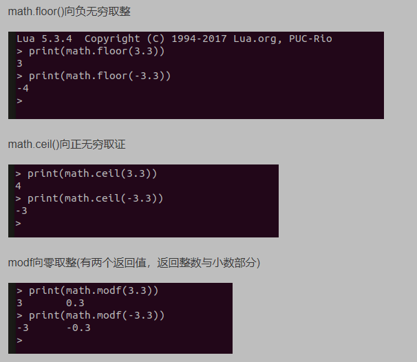

# Lua

## 字符串

```lua
print(string.format("pi:%.4f",math.pi))
--pi:3.1416

```

```lua
local day,month,year=28,2,1980
print(string.format("%02d/%02d/%02d",month,day,year)
--02/28/1980

```

```lua
local findString="Hello World"
local sBegin,sEnd=string.find(findString,"World")
print(sBegin,sEnd)
--7   11

```

```lua
local findString="Hello World"
local found=string.match(findString,"World")
print(found)
--World

```

```lua
local temp="I have 2 children"
local temp2=string.gsub(temp,"2","3")
print(temp2)
--I have 3 children

```

```lua
-- 字符串
local sourcestr = "prefix--runoobgoogletaobao--suffix"
print("\n原始字符串", string.format("%q", sourcestr))

-- 截取部分，第1个到第15个
local first_sub = string.sub(sourcestr, 4, 15)
print("\n第一次截取", string.format("%q", first_sub))

-- 取字符串前缀，第1个到第8个
local second_sub = string.sub(sourcestr, 1, 8)
print("\n第二次截取", string.format("%q", second_sub))

-- 截取最后10个
local third_sub = string.sub(sourcestr, -10)-1
print("\n第三次截取", string.format("%q", third_sub))

-- 索引越界，输出原始字符串
local fourth_sub = string.sub(sourcestr, -100)
print("\n第四次截取", string.format("%q", fourth_sub))
```

## 循环

```lua
local temp=true
local i=1
repeat
   print ("loop:"..i)
   if i==10 then
     temp=false
   end
until temp==true
--loop:1  (repeat至少执行一次)

```

## 迭代器

```lua
aay = {"Google", "Runoob"}

function elementIterator (collection)
   local index = 0
   local count = #collection
   -- 闭包函数
   return function ()
      index = index + 1
      if index <= count
      then
         --  返回迭代器的当前元素
         return collection[index]
      end
   end
end

for element in elementIterator(array)
do
   print(element)
end
--Google
--Runoob

```

## 操作系统

```lua
os.time()
os.date()
os.getenv() --返回环境信息
```

## 模块

```lua
moudle={}
function moudle.add(n1,n2)
  return n1+n2
end

moudle.constant="ha ha ha"

--in other srcript
m=require("moudle")

m.add(1,2)

```

## 参数传递

```lua
local function add(...) --...表示将所有参数传递

```

string.byte()参数默认值是 1

## ipairs和pairs

ipairs并不会输出table中存储的键值对，会跳过键值对，然后顺序输出table中的值，遇到nil则会停止。

而pairs会输出table中的键和键值对，先顺序输出值，再乱序（键的哈希值）输出键值对。

这是因为，table在存储值的时候是按照顺序的，但是在存储键值对的时候是按照键的哈希值存储的，并不会按照键的字母顺序或是数字顺序存储。

=》对于a来说，如果执行print(a[3]),输出的结果也会是Good。也就是说table并不会给键值对一个索引值。

也就是说，ipairs知识按照索引值顺序，打印出了table中有索引的数据，没有索引值的不管。

而pairs是先按照索引值打印，打印完成后再按照键值对的键的哈希值打印它的值。

## Math函数

- math.ceil():[lua](https://baike.baidu.com/item/lua)中的一个函数,math.ceil(x)返回大于等于参数x的最小整数,即对浮点数向上取整
- math.fmod():取余函数

## [function.xxx](http://function.xxx/)()和function:xxx()的区别

1. 使用.不会自带self参数
2. 使用:会自带self参数，self相当于this
3. [若定义时用function.xxx](http://xn--function-rk0mu31is2xzn4bhlzb.xxx/)()，调用时用function:xxxx()，会有一个self参数传进去

```lua
function MainScene:ctor()
    self:ceshi(1,2,3)
end
function MainScene.ceshi(a,b,c)  --注意是.
    print(a,b,c)
end
输出:userdata 1 2

```

1. 若定义时用function：xxx()，调用时用function.xxxx()，第一个参数会传给self

```lua
function MainScene:ctor()
    self.ceshi(1,2,3) --注意是.
end

function MainScene:ceshi(a,b,c)
    print(self)
    print(a,b,c)
end
输出：1
     2 3 nil

```

## Table引用传递

```lua
function Test(inputTable)
    inputTable = nil
end

local originTable = {[1] = "test"}
Test(originTable)

for i, v in pairs(originTable) do
    print(i,v)
end

```

Test方法是想清空originTable，但是直接将inputTable清空却没有达到效果。

究其原因，是因为在lua中，table作为参数是**引用传递。**

- 我一直不理解这个引用传递，看了很多篇文章才勉强理解，
- 就是当inputTable作为参数传入的时候，只是传入了一个指针，**指向originTable**在内存中**的地址**。
- 当我进行inputTable =nil清空操作的时候，只是将这个**指针指向的地址清空**，并不会修改到originTable的内容，要想做到清空表，只能遍历remove

```lua
function Test(inputTable)
    while #inputTable > 0 do
        table.remove(inputTable,#inputTable)
    end
end

```

### Table闭包

```lua
print("\nexample 3:");
function counter()
    local count = 0;
    return function()
        count = count + 1;
        return count;
    end
end

func = counter();
print(func());
print(func());
print(func());
--我期待的输出是1，1，1，结果输出了1，2，3

```

- **闭包：有权访问**另外一个函数作用域中的变量的函数

> 很多人会搞不懂匿名函数与闭包的关系，> 实际上，闭包是站在作用域的角度上来定义的。> 因为inner访问到outer作用域的变量，所以inner就是一个闭包函数。
> 
- **闭包坑点**:
    
    **坑点1： 引用的变量可能发生变化**
    
    **坑点2: this指向问题**
    

```lua
object = {
    ["name"] = "object",
    ["getName"] = function()
        return function()
            print(this.name)
        end
    end
}

object.getName()()--attempt to index global 'this' (a nil value)

```

<aside>
💡 **因为里面的闭包函数是在window作用域下执行的，也就是说，this指向windows**

</aside>

**坑点3：内存泄露问题**

## #和table.count的区别

#只能在顺序表使用

table.count没有限制，但是比#低效

table.count代码：

```lua
-- 计算哈希表长度
local function count(hashtable)
	local count = 0
	for _,_ in pairs(hashtable) do
		count = count + 1
	end
	return count
end
```

## Lua and or

Lua中还经常会用到 "a and b or c ",这类似于C语言中的表达式 a ? b : c，例如选出x和y中的较大者，可以使用一下语句：

max = (x>y) and x or y

证明如下：

若 x>y,则 (x>y) = true,则 (x>y) and x = x,则 max = x or y = x；

若 x<y,则 (x>y) = false,则 (x>y) and x =  (x>y)，则 max = (x>y) or y = y。

## Lua整除

“/”是除，“//”是整除

另外还有三个取整函数： **math.floor()，math.ceil()和math.modf()**



## Lua浅拷贝和深拷贝

浅拷贝：local b={}

         a=b

深拷贝：  

```lua
function DeepCopy(object)
    local filter_table={}
    local function _copy(object)
        if type(object) ~= "table" then
            return object
        elseif filter_table[object] then
            return filter_table[object]
        end

        local new_table={}
        for key, value in pairs(object) do
            new_table[_copy(key)]=_copy(value)
        end
        filter_table[object]=new_table --缓存一份
        return setmetatable(new_table,getmetatable(object))
    end
    return _copy(object)
end
```

<aside>
💡 Lua Table中的键是string类型的

</aside>

## Lua数字前面补零

lua 用string.format 进行格式化字符串，有时会输出类似与 XX：XX:XX的时间字串，可以用 string,format("%02d:%02d:%02d")进行格式化输出字符串

## Lua元表

元表可以实现lua中两个表的相加操作，允许我们改变table的行为，每个行为对应一些元方法。

- 让一个表变成元表
    
    ```lua
    local mytable={}
    lcoal mymetatable={}
    mytable=setmymetatable(mytable,mymetable)
    ```
    
- 元表中的__index元方法
    
    1.__index键，在表中没有对应的键是，如果有元表，就会去查看__index中有没有对应的键
    
    2.如果__index键关联的是一个表，这回去查看关联的表中有没有对应的键
    
    ```lua
    local other={foo=3}
    mytable=setmetatable({key1="key1"},{
        __index=other
    })
    
    print(mytable.foo)
    
    --3
    ```
    
    3.如果__index键关联的是一个方法，则会调用这个方法。
    
    ```lua
    local mytable=setmetatable({key1="key1"},{
        __index=function (table,key)
            if key=="key2" then
                return "key2:this is mymetatable"
            else
                return table.key1
            end
        end
    })
    
    print(mytable.key1)
    print(mytable.key2)
    print(mytable.key3)
    
    --key1
    --key2:this is mymetatable
    --key1
    
    ```
    
    ### 总结
    
    lua查找表中元素的规则：
    
    1. 在表中查找，如果找到，返回该元素，找不到则继续
    2. 判断该表中是否有元表，如果有元表则继续，否则返回nil
    3. 判断元表中是否有__index键，如果有，再判断__index键中绑定的是表还是方法，如果是表，则重复1,2,3方法，如果是函数则执行函数。
- 元表中的__newindex元方法
    
    __**newindex方法可以对表进行更新，当对表中一个未定义的键赋值是，则会查找表中的__new**index,如果存在，则调用__newindex中的方法而不赋值，如果键已存在，则直接改变键值，不调用__newindex中的方法
    
    ```lua
    local mymetatable={}
    local mytable=setmetatable({key1="keyvalue"},{__newindex=mymetatable})
    
    mytable.key1="新值1"
    print(mytable.key1)
    print(mymetatable.key1)
    mytable.newkey="新值2"
    print(mytable.newkey)
    print(mymetatable.newkey)
    ```
    
- 用rawset来更新表
    
    ```lua
    local mytable=setmetatable({key1="key1"},{
        __newindex=function (mytable,key,value)
            rawset(mytable,key,"\""..value.."\"")
        end
    })
    
    mytable.key1="新值"
    mytable.key2="newValue"
    print(mytable.key1)
    print(mytable.key2)
    ```
    
- 两表相加
    
    ```lua
    function table_maxn(t)
        local mn=0
        for key, value in pairs(t) do
            if mn<key then
                mn=key
            end
        end
        return mn
    end
    
    ---两表相加
    local mytable=setmetatable({1,2,3},{
        __add=function (mytable,newtable)
            for i = 1, table_maxn(newtable) do
                table.insert(mytable,table_maxn(mytable)+1,newtable[i])
            end
            return mytable
        end
    })
    
    local secondtable={4,5,6}
    mytable=mytable+secondtable
    
    for k, v in pairs(mytable) do
        print(v)
    end
    ```
    

## Lua协同程序

<aside>
💡 拥有独立的堆栈，独立的局部变量，独立的指令指针，同时又与其它协同程序共享全局变量和其它大部分东西。

</aside>

<aside>
💡 协程在同一时间只有一个协程可以在运行，需要彼此协作运行，在运行的协同程序只有在明确指令要求其挂起的时候才会挂起。

</aside>


方法示例：

```lua
local i=0
co1=coroutine.create(function ()
    while i<10 do
        if i==3 then
            print(coroutine.status(co1))
            print(coroutine.running())
        end
        i=i+1
        print(i)
        coroutine.yield()
    end
end)

coroutine.resume(co1)
coroutine.resume(co1)
coroutine.resume(co1)
coroutine.resume(co1)

print(coroutine.running())

--1
--2
--3
--running
--thread: 000001FAF5977AD8	false
--4
--thread: 000001FAF58AE458	true

```

使用lua协程实现生产者消费者问题

```lua
local newProductor

function Productor()
    local i=0
    while i<10 do
        i=i+1
        Send(i)
    end
end

function Send(i)
    coroutine.yield(i)
end

function Customer()
    local j=0
    while j<10 do
        j=Receive()
        print(j)
    end
end

function Receive()
    local status,value=coroutine.resume(newProductor)
    return value
end

newProductor=coroutine.create(Productor)
Customer()

--1
--2
--3
--running
--thread: 000001FAF5977AD8	false
--4
--thread: 000001FAF58AE458	true

```

## Lua垃圾回收

lua采用自动内存管理机制，也就是我们不用去关系他是如何分配内存的，也不用关心当一个变量不再使用后，他去如何回收内存（只要把他变成nil）。

有两个数值去控制垃圾回收的周期：

1. 垃圾收集暂停时间
这个参数表示垃圾收集器下一次运行之前要等待多长时间，这个值越大垃圾收集器则越不主动。如果达到200则表示内存大小要到上一次收集内存的两倍才会执行。如果小于100，则垃圾收集器不会等待。
2. 垃圾收集步长倍增器
这个参数越大垃圾收集器越主动。默认为200，若这个值低于100，则可能导致垃圾收集器一个周期不能结束。


```lua
local mytable={"apple","boy","girl"}

print(collectgarbage("count"))

mytable=nil
--做完一次完整的垃圾回收
print(collectgarbage("collect"))
print(collectgarbage("count"))
--单步运行垃圾收集器
print(collectgarbage("step",2))
--设置垃圾收集器的间歇率，返回间歇率的前值
print(collectgarbage("setpause",50))

--72.064453125
--0
--45.232421875
--false
--200
```

## Lua面向对象

用表来表现属性，用function实现方法，也可以用元表来模拟继承

示例

```lua
People={age=0,sex=""}

function People:new(o,age,sex)
    o=o or {}
    --指派自己为自己的元表
    setmetatable(o,self)
    self.__index=self
    self.age=age or 0
    self.sex=sex or 0
    return o
end

function People:PrintAttribute()
    print(self.age.." "..self.sex)
end

local myPeople=People:new(nil,24,"male")
myPeople:PrintAttribute()

--继承
Student=People:new()    --将子类表和父类表连接起来
function Student:new(o,age,sex)
    o=o or People:new(o,age,sex)
    setmetatable(o,self)
    self.__index=self
    return o
end
--重写父类方法
function Student:PrintAttribute()
    print("年龄："..self.age.."性别："..self.sex)
end

local student=Student:new(nil,5,"female")
student:PrintAttribute()

--24 male
--年龄：5性别：female
```

## Lua模块与包

Lua中的模块也是一个表，在里面可以放一些公用的代码，然后以API的方式提供调用。

调用的方式可以是 require(””)

```lua
-- 文件名为 module.lua
-- 定义一个名为 module 的模块
module = {}
 
-- 定义一个常量
module.constant = "这是一个常量"
 
-- 定义一个函数
function module.func1()
    io.write("这是一个公有函数！\n")
end
 
local function func2()
    print("这是一个私有函数！")
end
 
function module.func3()
    func2()
end
 
return module
```

### Lua中Require

require会阻止多次加载相同的模块，在加载之前会先去检查package.load表中是否已存在要导入的模块，如果已经存在就返回要导入的模块，如果没有就加载。

## Lua错误处理

### assert方法

assert方法会检测第一个参数有没有出错，如果出错了，就不检测后一个，反之检测后一个，一个个往下检测

```lua
local function add(a,b)
    assert(type(a)=="number","a不是一个数字")
    assert(type(b)=="number","b不是一个数字")
    return a+b
end
add(10,"r")
```

```lua
c:/Users/Administrator/.vscode/extensions/actboy168.lua-debug-1.53.0/runtime/win32-x64/lua54/lua.exe: interrupted!
stack traceback:
	[C]: in ?
	[C]: in function 'assert'
	D:\Lua/ErrorDebug.lua:3: in local 'add'
	D:\Lua/ErrorDebug.lua:6: in main chunk
	[C]: in ?
```

### error方法

error会抛出堆栈错误信息以及错误位置信息

语法格式：`error (message [, level])`

level默认为1

- Level=1[默认]：为调用error位置(文件+行号)
- Level=2：指出哪个调用error的函数的函数
- Level=0:不添加错误位置信息

```lua
function MyError()
    error("error test1")
end

MyError()
```

```lua
c:/Users/Administrator/.vscode/extensions/actboy168.lua-debug-1.53.0/runtime/win32-x64/lua54/lua.exe: interrupted!
stack traceback:
	[C]: in ?
	[C]: in function 'error'
	D:\Lua/ErrorDebug.lua:9: in function 'MyError'
	D:\Lua/ErrorDebug.lua:12: in main chunk
	[C]: in ?
```

### Pcall方法

pcall接收一个函数和要传递给后者的参数，并执行，执行结果：有错误、无错误；返回值true或者或false, errorinfo。

```lua
pcall(function (i)
    print(i)
    error("报错了！")
end,22)
```

pcall以“保护模式”来调用第一个参数，但pcall返回时已经销毁部分调用栈的内容

为此lua还提供了xpcall

### Xpcall方法

xpcall会调用第二个参数，一个错误处理参数，lua会在调用栈展开之前调用错误处理函数，一次查看到更多的错误信息

```lua
function MyXpcall(i)
    i=i/nil
end

function XpcallError(err)
    print("error:"..err)
end

Status=xpcall(MyXpcall,XpcallError,5)

print(Status)
```

```lua
error:D:\Lua/ErrorDebug.lua:16: attempt to perform arithmetic on a nil value
false
```

## Lua I/O读取文件

`file = io.open (filename [, mode])`


```lua
local file=io.open("text.lua",r)
print(file:read())

local file=io.open("text.lua","a")
print(file:write("-----注释"))
```

**file:seek(optional whence, optional offset):**设置和获取当前文件位置,成功则返回最终的文件位置(按字节),失败则返回nil加错误信息

参数 whence 值可以是:

- "set": 从文件头开始
- "cur": 从当前位置开始[默认]
- "end": 从文件尾开始
- offset:默认为0

# Lua热更新

原理：使用require导入要更新的模块，由于require会阻止重复加载相同的模块，所以在热更的时候首先要讲package.load表变为nil。同时有些要保留旧数据，并把当前要更新的模块所有的引用都更新

```lua
function reload(moudle_name){
		local old_moudle=packge.load(moudle_name)
		package.load[moudle_name]=nil
		require(moudle_name)
		
		local new_moudle=package.load[moudle_name]
		for k,v in pairs(new_moudle) do
				old_moudle[k]=v
		end
		package.load[moudle_name]=old_moudle

```

# **Lua的数据结构和内存占用**

lua的数据结构的内存分配是动态的,常见的数据结构是string和table。

# Require,LoadFile和DoFile

require和dofile都会编译且执行，loadfile只会编译