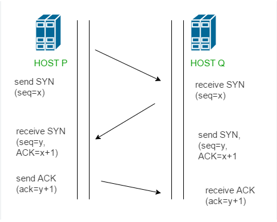
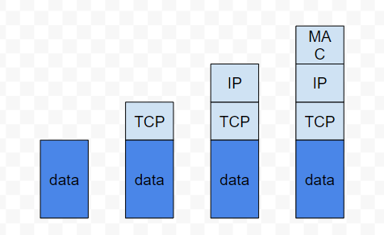
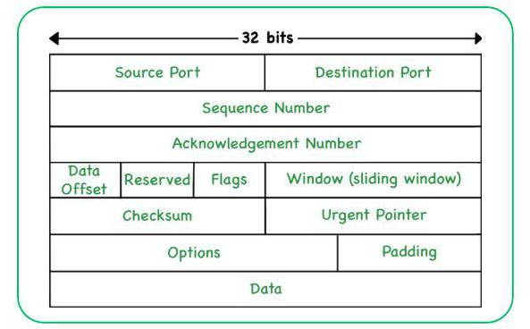

## TCP/ IP Intro

### The TCP three handshake

This is the picture of three handshake of TCP.



The TCP three-way handshake is a process used by TCP (Transmission Control Protocol) to establish a connection between two devices over a network. It is a key part of TCP's reliable, connection-oriented communication model. The handshake involves three steps:

1. **SYN (Synchronize)**: The process begins with the client sending a SYN packet to the server, indicating its intention to establish a connection. This packet contains a randomly generated sequence number that the client chooses.

2. **SYN-ACK (Synchronize-Acknowledge)**: Upon receiving the SYN packet, the server responds with a SYN-ACK packet. In this packet, the server acknowledges the client's SYN request and sends its own SYN packet to the client. Like the client's SYN packet, the server's SYN-ACK packet also contains a randomly generated sequence number.

3. **ACK (Acknowledgment)**: Finally, the client acknowledges the receipt of the server's SYN-ACK packet by sending an ACK packet back to the server. This packet acknowledges the server's sequence number and completes the three-way handshake. At this point, the connection is established, and both parties can begin exchanging data.

Once the three-way handshake is complete, both the client and server have agreed upon initial sequence numbers (ISNs) and other parameters necessary for communication. This ensures that both parties are synchronized and ready to reliably exchange data over the established TCP connection.

### why is 3 handshake? why not 2? or 4?

TCP is a reliable protocol, it need to be ensure that each request has a reply. For example, Client send a request to server, then it must to get a reply from server to ensure the server receives the message it sends. Similarly, server sends a request to client, and it also need to get  response from client to ensure client gets the message it sends.

If there are only two times handshake, we can imagine that, if client sends 2 connection request packets to server, one of them is received by server, them server sends a reply to client, then the connection is completed. However, another pockets of data is late, then when server gets this message, it will regard this message as a new connection request, then it will reply again, but now, the connection is already completed, that's can lead an error.

4 times handshake can wastes resources, so 3 handshake is enough.

### About sequence in handshake

In each request in TCP, there is a sequence number in each pocket, this number is calculated from real-time, but why this sequence number not start from 1?

Here is the reason. For example, after the connection is completed, now, if client sends two pockets, which one of them the sequence number is 1, the another one is 2, then server receive the pocket with sequence number 1, and the server reply, but the pocket 2 is late, and now, client is disconnect. After client connect back again, it send another message with start sequence number 1 to server again, now there is something happened, after server reply the reconnection message 1, it gets the late message 2 which is sent before client reconnection, but server will regards this as a message after reconnection, so now, it can lead to an error.

### TCP message pocket



### TCP head:

1. **Source Port**: This field specifies the port number on the sending device.
2. **Destination Port**: This field specifies the port number on the receiving device.
3. **Sequence Number**: Used for data reassembly at the receiving end, ensuring packets are sorted in the correct order.
4. **Acknowledgement Number**: If the ACK flag is set, this value is the next sequence number that the sender of the packet expects to receive.
5. **Data Offset**: Also known as the header length, this field indicates where the data begins or the length of the TCP header.
6. **Reserved**: A reserved area of the header for future use, which should be set to zero.
7. **Flags**: A set of 9 1-bit indicators (flags) that control the flow of data and connection establishment, maintenance, and termination. Common flags include SYN (synchronize), ACK (acknowledge), and FIN (finish).
8. **Window (sliding window)**: This field is used for flow control and specifies the size of the sender's receive window (the amount of data that can be sent before receiving an acknowledgment).
9. **Checksum**: A checksum for error-checking of the header and data.
10. **Urgent Pointer**: If the URG flag is set, this field indicates the offset from the sequence number indicating the last urgent byte.
11. **Options**: This field may be used for various control purposes, like setting the maximum segment size, or for timestamps.
12. **Padding**: This is used to ensure the header is a multiple of 32 bits in length.
13. **Data**: This area contains the payload data being transmitted.



### How TCP ensure its reliable

TCP (Transmission Control Protocol) is a foundational protocol in the Internet Protocol Suite, designed to provide a reliable, ordered, and error-checked delivery of a stream of bytes between applications running on hosts communicating via an IP network. TCP's reliability is achieved through several mechanisms and features, which together solve various challenges and cases inherent in network communications. Here's an overview of how TCP ensures reliability and how it addresses specific scenarios:

##### 1. **Three-Way Handshake for Connection Establishment**
Before any actual data transfer begins, TCP initiates a three-way handshake between the client and server to establish a connection. This process ensures that both ends are ready for data transmission and agree on initial sequence numbers, which are critical for maintaining order and reliability.

- **SYN**: The client starts by sending a SYN (synchronize) packet to the server, indicating the start of a new connection and the initial sequence number.
- **SYN-ACK**: The server responds with a SYN-ACK (synchronize-acknowledge) packet, acknowledging the client's sequence number and providing its own.
- **ACK**: Finally, the client sends an ACK (acknowledge) packet back to the server, acknowledging the server's sequence number.

##### 2. **Sequence Numbers and Acknowledgments**

Each byte of data sent over a TCP connection is assigned a sequence number, which is used to ensure that data is delivered in order and without duplication. The receiver uses ACK packets to acknowledge the receipt of data, specifying the next expected sequence number. This mechanism allows both the sender and receiver to manage and synchronize the flow of data.

##### 3. **Retransmission and Timeouts**
TCP implements a retransmission strategy for dealing with packet loss. When the sender dispatches a segment, it starts a timer. If the corresponding ACK is not received before the timer expires, the segment is presumed lost and is retransmitted. TCP dynamically adjusts the timeout interval based on network conditions to optimize performance.

##### 4. **Flow Control**
Flow control prevents the sender from overwhelming the receiver with too much data at once. TCP uses a sliding window mechanism, where the receiver specifies a window size in its ACKs, indicating how many more bytes of data it can accept. The sender must not send more data than the window size allows, ensuring that the receiver can process incoming data without being overrun.

##### 5. **Congestion Control**
TCP also includes mechanisms for congestion control, which aim to prevent network congestion by adjusting the rate of data transmission based on the perceived load of the network. Algorithms like Slow Start, Congestion Avoidance, Fast Retransmit, and Fast Recovery are employed to dynamically manage data flow, reducing the transmission rate when congestion is detected and gradually increasing it when the network is clear.

##### Specific Cases TCP Addresses:
- **Packet Loss**: Through retransmission based on timeouts and duplicate ACKs.
- **Data Corruption**: Checksums in the TCP header allow the receiver to detect corrupted segments, which are then discarded and retransmitted.
- **Out-of-Order Delivery**: Sequence numbers enable the receiver to reorder segments that arrive out of sequence.
- **Duplication**: Sequence numbers and ACKs help to identify and discard duplicate segments.

In summary, TCP's design incorporates a comprehensive set of strategies to ensure that data is transferred reliably over the unpredictable environment of IP networks. These mechanisms work together to handle packet loss, data corruption, order, duplication, flow control, and congestion, making TCP suitable for applications where reliable data transmission is critical.

## UDP

UDP protocol doesn't care about the stability of the network, and it doesn't guarantee the order of the packets. But it is faster than TCP since it doesn't build a connection. It just sends packets and doesn't resend packets.

```
     sender                     receiver
       ｜													 ｜
       ｜				data packet1			 ｜
       ｜-------------------------->｜
       ｜				data packet2			 ｜
       ｜-------------------------->｜
       ｜				data packet3			 ｜
       ｜-------------------------->｜
     sender                     receiver
```

#### UDP Client

```c#
using System;
using System.Net;
using System.Net.Sockets;
using UnityEngine;

public class UDPExample : MonoBehaviour
{
    private UdpClient udpClient;
    private IPEndPoint remoteEndPoint;

    private void Start()
    {
        StartUDPClient("127.0.0.1", 5555);
    }

    private void StartUDPClient(string ipAddress, int port)
    {
        udpClient = new UdpClient();
        remoteEndPoint = new IPEndPoint(IPAddress.Parse(ipAddress), port);

        // start Async receive
        udpClient.BeginReceive(ReceiveData, null);

        // send message to server
        SendData("Hello Server！");
    }

    private void ReceiveData(IAsyncResult result)
    {
        byte[] receivedBytes = udpClient.EndReceive(result, ref remoteEndPoint);
        string receivedMessage = System.Text.Encoding.UTF8.GetString(receivedBytes);

        Debug.Log("Receive data from server： " + receivedMessage);

        udpClient.BeginReceive(ReceiveData, null);
    }

    private void SendData(string message)
    {
        byte[] sendBytes = System.Text.Encoding.UTF8.GetBytes(message);

        udpClient.Send(sendBytes, sendBytes.Length, remoteEndPoint);

        Debug.Log("Sended to Server： " + message);
    }
```

#### UDP Server

```c#
using System;
using System.Net;
using System.Net.Sockets;
using UnityEngine;

public class UDPServer : MonoBehaviour
{
    private UdpClient udpServer;
    private IPEndPoint remoteEndPoint;

    private void Start()
    {
        StartUDPServer(5555);
    }

    private void StartUDPServer(int port)
    {
        udpServer = new UdpClient(port);
        remoteEndPoint = new IPEndPoint(IPAddress.Any, port);

        Debug.Log("Server already begin...");

        udpServer.BeginReceive(ReceiveData, null);
    }

    private void ReceiveData(IAsyncResult result)
    {
        byte[] receivedBytes = udpServer.EndReceive(result, ref remoteEndPoint);
        string receivedMessage = System.Text.Encoding.UTF8.GetString(receivedBytes);

        Debug.Log("Receive form client： " + receivedMessage);

        // processing data

        udpServer.BeginReceive(ReceiveData, null);
    }

    private void SendData(string message, IPEndPoint endPoint)
    {
        byte[] sendBytes = System.Text.Encoding.UTF8.GetBytes(message);

        udpServer.Send(sendBytes, sendBytes.Length, endPoint);

        Debug.Log("Send to Client： " + message);
    }
}
```


## Websocket

WebSocket is a protocol based on the TCP application layer, TCP uses data stream in data transmission, but different from TCP, WebSocket uses **message** in transmission. In addition, different common HTTP, WebSocket is a two-way protocol, it not only can response the message from clients but also can send data to clients. And WebSocket has some additional functions, maybe cost in performance.

Here's how it works, step by step:

- The client sends a special HTTP request called an "upgrade request". This request informs the server that the client wants to switch to WebSocket.


- If the server supports WebSocket and agrees to the switch, it responds with a special HTTP response that confirms the upgrade to WebSocket.


- Exchanging these messages establishes a persistent, two-way connection between the client and the server. Both parties can send messages at any time, not just in response to a request from the other party.


- Now the client and server can send and receive messages at any time. Each WebSocket message is contained in "frames" that indicate when the message begins and ends. This allows browsers and servers to correctly interpret messages, even if they arrive in mixed order or are split into multiple parts due to network problems.

```
Client ──────> Router/Switch ──────> Firewall ──────> Server
   ↑                                                       ↓
   └──────────────────────────────── Bidirectional Communication ────────────┘
```

#### Code of Websocket Client

```c#
using UnityEngine;
using WebSocketSharp;

public class WebSocketClient : MonoBehaviour
{
    private WebSocket ws;

    void Start()
    {
        ws = new WebSocket("ws://your-websocket-server-url/Auth");

        ws.OnOpen += OnOpenHandler;
        ws.OnMessage += OnMessageHandler;

        ws.ConnectAsync();
    }

    private void OnOpenHandler(object sender, System.EventArgs e)
    {
                var data = "Player1";
                ws.Send(data)
    }

    private void OnMessageHandler(object sender, MessageEventArgs e)
    {
        Debug.Log("WebSocket Server says： " + e.Data);
    }
}
```

#### Code of WebSocket Server

```c#
using UnityEngine;
using WebSocketSharp;
using WebSocketSharp.Server;

public class WebSocketServer : MonoBehaviour
{
    void Start()
  {
    var socket = new WebSocketServer("ws://your-websocket-server-url");
    socket.AddWebSocketService<AuthBehaviour>("/Auth");
    socket.Start();
  }
}

// AuthBehaviour is derive from WebSocketBehavior, it handle the message from client
public class AuthBehaviour : WebSocketBehavior
{
  protected override void OnMessage (MessageEventArgs e)
  {
      var playerName = e.Data;
      Debug.Log("WebSocket client connected： " + playerName);
            Send("authentication completed： " + playerName);
  }
}
```

