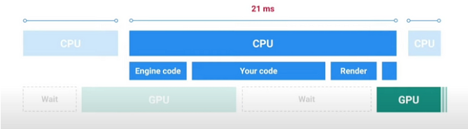
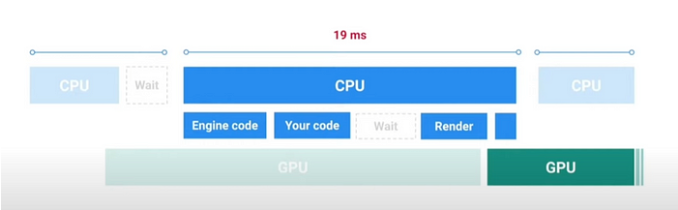

## Unity 性能分析

### 如何在unity中检查性能

主要可以分为两个部分， CPU和GPU
```
- **CPU**
    - 准备
        - 对相似对象进行分组（批处理）
        - 物理
        - 游戏逻辑
        - 输入
- **GPU**
    - 处理
        - 渲染
        - 着色器
        - 照明
```

### 目标帧率

60 fps：1秒钟60帧， 每帧 1000ms/60 = 16.66ms
30 fps：1秒钟30帧， 每帧 1000ms/30 = 33.33ms

### 帧结构 - CPU受限



在这幅图中，我们看到 **CPU 部分**（引擎代码、你的代码、渲染）占用了大部分帧时间（**21 毫秒** ），而 **GPU 部分** 相对较短。这表明这是一个 **CPU 受限场景** 。当 CPU 超负荷，完成任务所需的时间比预期长时，就会造成瓶颈，迫使 GPU 等待 CPU 完成任务，才能开始渲染帧。这种等待时间会增加总的帧时间，导致帧率降低，游戏体验不流畅。

### 帧结构 - GPU受限 



在这幅图中，我们看到 CPU 部分（引擎代码、你的代码、等待）占用的帧时间相对较少（19 毫秒），而两个 GPU 部分占用了大部分帧时间。这表明 GPU 是瓶颈。CPU 已经很快完成了帧的处理任务，现在正在等待 GPU 完成渲染。这种等待时间会增加总的帧时间，导致帧率降低，游戏体验不流畅。

### 性能问题

- **脚本问题**。低效循环、冗余计算和不恰当使用协程会导致游戏逻辑变慢。（**就像峰值一样**）
- **图形超负荷**。过度使用高多边形模型和未优化的着色器会导致超负荷，从而给渲染过程带来压力。
- **物理复杂性**。过度依赖实时模拟、过多的碰撞体和复杂的计算会阻碍游戏物理。（**物理时间**）
- **内存压力**。内存泄漏、大型未优化的资源和频繁的垃圾回收会导致意外延迟，从而惹恼玩家。（**内存使用情况**）
- **资源加载延迟**。同步加载和即时加载大型资源会破坏游戏连续性，降低其可玩性。（**加载时间**）