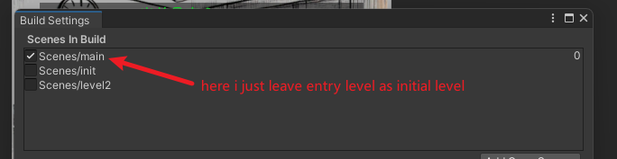

## What is Addressable

Addressable is a tool designed to manage assets more efficiently by allowing developers to load, unload, and manage asset references dynamically at runtime, with a focus on reducing memory usage and optimizing loading times.

## How to use Addressable

1. install Addressable package from package manager
2. choose the assets which you want to tag "addressable", I separated my bundle into two parts, one for the enter level, the rest for levels.
   In my game, there are 3 levels, "Entry", "Tutorial" and "Battle". The "Tutorial" level is small, so I make "Tutorial" and "Battle" as one package, the "Entry" as an independent package. Then separate the assets, and click the "addressable" checkbox for them. In the game, I tag all assets which used for "Tutorial" and "Battle" level. 
   
   
3. You can set `group` for assets, and you also can set `labels` for assets. `labels` can be used when you want to load assets dynamic.
   ![[Pasted image 20240916151938.png]]
4. When assets separation is finished, we can click `Build` to pack the game. 

## Use assets in Addressable

if we use Addressable, we can't use `Resources.Load<>()` anymore, we need to use `Addressables.LoadAssetAsync` API

Here are some examples:
```c#
// load assets
Addressables.LoadAssetAsync<GameObject>(bossPreAddress).Completed += OnAssetLoaded;

// load scene
Addressables.LoadSceneAsync(level, LoadSceneMode.Single).Completed += OnMainLevelLoaded;
```