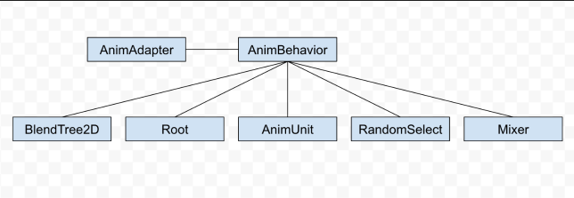
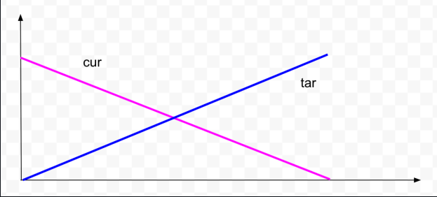
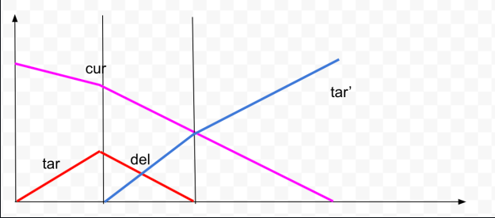

# InputSystem

The traditional Animation Controllers are complex and easy to be messy. We can use Playable to build a custom Animation system.

[https://github.com/x739809514/AnimationSystem](https://github.com/x739809514/AnimationSystem)

## Architecture of System

I want the system to switch state between several animation clips easily, so I need a `mixer` node, and I also need a default state, such as idle. In addition, I  also want to have a random animation selector to play random animation.



### Code Structure

First, we need to have an abstract class which is called `AnimBehavior`, this class is the parent of all animation nodes, and we can build child classes which are inherent in it, such as `AnimUnit`, and Mixer.
Second, I build an empty node -- `AnimAdapter`, which controls `AnimBehavior`. In addition, `AnimAdapter` is also a node, but it does nothing instead of controlling behaviour.


## Classes

### AnimationBehavior.cs

In this class, we should make it abstract, and it needs several virtual methods: `Enable()`, `Disable()`, `AddInput()`, and `Execute()`.

1. `Enable()`: enable node, play animation clips
2. `Disable()`: disable nodes, and pause animation clips
3. `AddInput()`: since we need mixer nodes, it is used to add clips to mix node
4. `Execute()`: node executes per frame, so these methods need to be processed in `PrepareFrame()`

```
public virtual void Enable()
{
    enabled=true;
    remainTime = GetAnimLength();
}

public virtual void Disable()
{
    enabled=false;
}

public virtual void Execute(Playable playable,FrameData info)
{
    if(enabled==false)return;
    remainTime = remainTime > 0 ? remainTime - info.deltaTime : 0f;
}

```

### AnimationAdapter.cs

This is an empty node, the only thing it does is control behaviour. It controls if behaviour nodes need to enable, disable or execute. And it stores an instance about animation behaviour.

```
public class AnimAdapter : PlayableBehaviour
{
    public AnimBehaviour animBehaviour;
    public void Init(AnimBehaviour animBehaviour)
    {        this.animBehaviour = animBehaviour;
    }
    public void Enable()
    {        animBehaviour?.Enable();
    }
    public void Disable()
    {        animBehaviour?.Disable();
    }
    public override void PrepareFrame(Playable playable, FrameData info)
    {        animBehaviour?.Execute(playable,info);
    }
    public float GetAnimEnterTime()
    {        return animBehaviour.GetEnterTime();
    }}

```

### AnimUnit. cs

This is a specific clip class, it inherits from `AnimationBehavior.cs` Each clip has an `AnimUnit` node, you can store any information about the clip in this class, like animation length or enter time. And in this animation system, we operate clips by this class.

```
public class AnimUnit : AnimBehaviour
{
    private AnimationClipPlayable clipPlayable;
    private AnimationClip clip;
    private double animStopTime;

    public AnimUnit(PlayableGraph graph,AnimationClip clip,float enterTime=0f):base(graph,enterTime)
    {
	    this.clip = clip;
        clipPlayable = AnimationClipPlayable.Create(graph,clip);
        animAdapter.AddInput(clipPlayable,0,1.0f);
        Disable();
    }
    public override void Enable()
    {
	    base.Enable();
        animAdapter.SetTime(animStopTime);
        clipPlayable.SetTime(animStopTime);
        animAdapter.Play();
        clipPlayable.Play();
    }
    public override void Disable()
    {
	    base.Disable();
        animAdapter.Pause();
        clipPlayable.Pause();
        animStopTime = animAdapter.GetTime();
    }
    public override float GetAnimLength()
    {
	    return clip.length;
    }
}

```

### Mixer. cs

This is a custom mixer node, I want to have damping when two animation clips are switching, and it allows to be interrupted by a third additional animation. We can consider these two cases:
1. general

- cur. speed = 1 / switch time
- tar. weight = 1- cur. weight
2. non-general


del is the clip which is interrupted by a new target. so when a new additional clip is coming, we need to decrease the weights of the current clip and old target clips. The weight for the new target is `1-cur.weight-del.weight`**normal speed = 1 / switch time,
decline speed = 2 / switch time, target weight = 1 - cur. weight - del. weight**
We use clip index to switch animation, so the idea is to build two indexes: current index and target index, we also need a list to store several decline indexes, since sometimes maybe there are several new targets, and we need to switch much time. For example, if there are 4 clips [1,2,3,4], we make system switch to 3 when 1 and 2 are switching, and then we need to compare the weight of 1 and 2, if `weight(1) > weight(2)` , we add to decline list, if `weight(1) < weight(2)` that means, the switch between 1 and 2 is coming to an end, so now 2 is cur, we add 1 to decline list, the weight of 3 is `1-weight(cur)-weight(del.list)`.

### RandomSelector

This node is used to choose clips randomly, we also need a mixer node here and switch animation between clips.
The idea is that we can store a field which is called `currentIndex`, wen can choose a clip by setting `currentIndex` for the mixer. Then set weight from 0 to 1.

```
public void Select()
{
    CurIndex = Random.Range(0, ClipCount);
}
public override void Enable()
{
    if (CurIndex < 0 || CurIndex > ClipCount) return;
    mixer.SetInputWeight(CurIndex, 1.0f);
    AnimHelper.Enable(mixer.GetInput(CurIndex));
    animAdapter.SetTime(0);
    animAdapter.Play();
    mixer.SetTime(0);
    mixer.Play();
}

```

### Root. cs

This is the root node for `AnimUnit`, I use this node to enable or disable all nodes belonging to it.

```
public override void Enable()
{
    for (int i = 0; i < animAdapter.GetInputCount(); i++)
    {        var adapter = AnimHelper.GetAdapter(animAdapter.GetInput(i));
        adapter.Enable();
    }}

public override void Disable()
{
    for (int i = 0; i < animAdapter.GetInputCount(); i++)
    {        var adapter = AnimHelper.GetAdapter(animAdapter.GetInput(i));
        adapter.Disable();
    }}
}
```